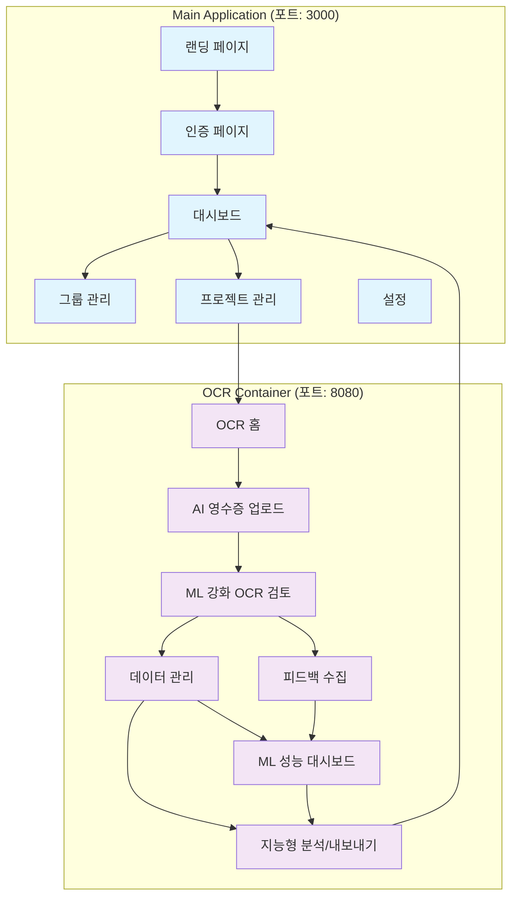
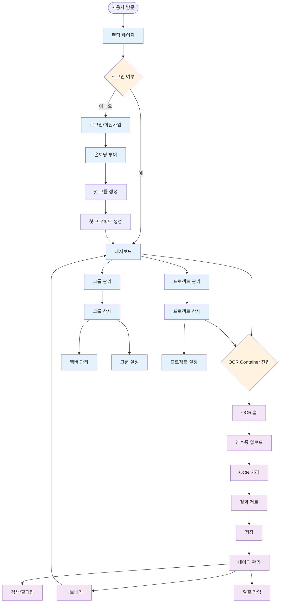
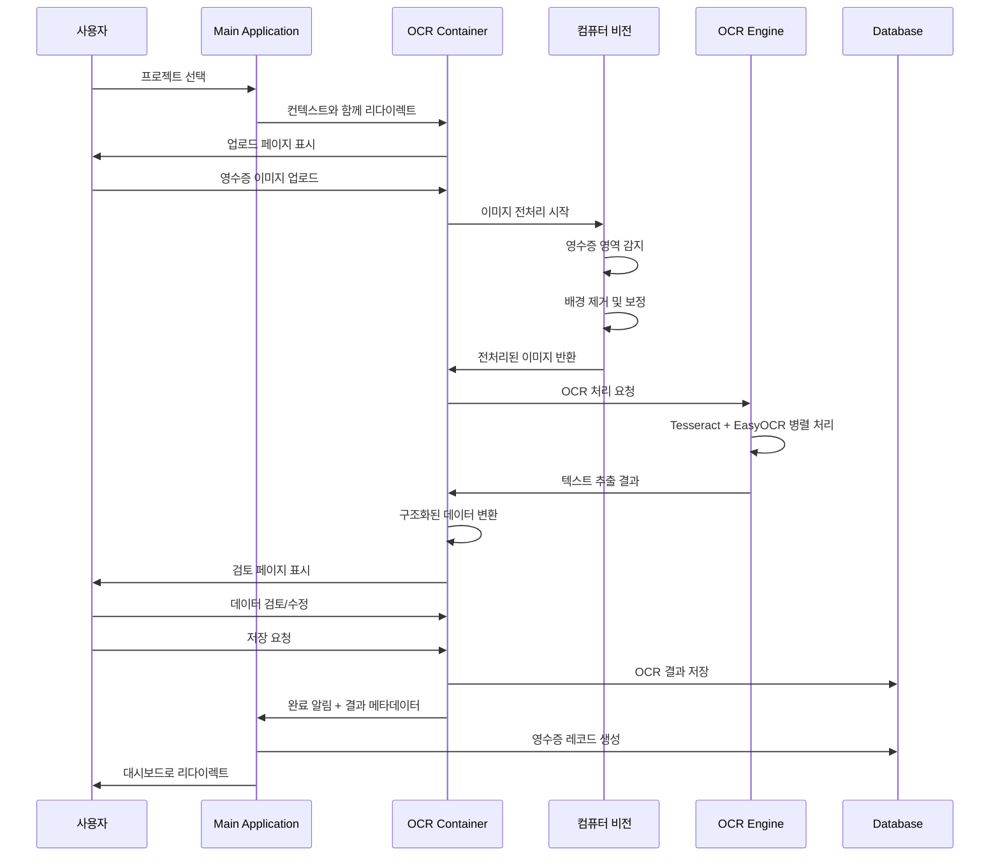

# Receipt OCR Management System - Frontend Architecture Document

## 1. Executive Summary

본 문서는 Receipt OCR Management System의 프론트엔드 서비스 페이지 구성과 사용자 경험(UX) 설계를 정의합니다. 시스템은 두 개의 연동된 프론트엔드로 구성되어 있으며, **머신러닝 기반 지능형 OCR 처리**와 **사용자 피드백 수집**을 통한 지속적 성능 향상, 사용자 중심의 직관적인 인터페이스와 접근성을 최우선으로 고려합니다.

### 1.1 프론트엔드 구조 개요
- **Main Application**: 그룹/프로젝트 관리, 대시보드, 협업 기능
- **OCR Container**: ML 강화 영수증 처리, AI 지원 데이터 검토, 지능형 분석 기능
- **연동 방식**: 싱글 사인온(SSO)과 컨텍스트 전달을 통한 seamless 사용자 경험

### 1.2 설계 원칙
- **사용자 중심 설계**: 업무 플로우에 최적화된 직관적 인터페이스
- **AI 투명성**: ML 모델 예측 및 신뢰도를 시각적으로 표시
- **피드백 중심**: 사용자 수정 데이터를 자연스럽게 학습 데이터로 수집
- **접근성 우선**: WCAG 2.1 AA 준수로 모든 사용자가 접근 가능
- **반응형 디자인**: 모바일부터 데스크톱까지 일관된 경험
- **성능 최적화**: ML 추론 시간 포함 3초 이내 로딩, 부드러운 인터랙션

## 2. 전체 서비스 플로우 및 사용자 여정

### 2.1 서비스 구조도



### 2.2 주요 사용자 여정

#### 2.2.1 신규 사용자 온보딩 (First Time User Experience)

```
1. 랜딩 페이지 → 서비스 소개 및 가치 제안
2. 회원가입 → 간소화된 폼 (이메일 인증)
3. 온보딩 투어 → 주요 기능 안내 (3단계)
4. 첫 그룹 생성 → 가이드형 설정 마법사
5. 첫 프로젝트 생성 → 템플릿 제공
6. 첫 영수증 업로드 → AI 기능 소개 튜토리얼 모드
7. ML 강화 OCR 결과 검토 → 신뢰도 지표 설명 가이드
8. 피드백 제공 및 학습 효과 확인 → AI 성능 지표 안내
9. 완료 축하 → ML 개인화 안내 및 다음 단계 제안
```

#### 2.2.2 일상 업무 플로우 (Daily Workflow)

```
로그인 → ML 성능 대시보드 확인 → 프로젝트 선택 → OCR Container 진입
       ↓
AI 영수증 업로드 → ML 처리 대기 → 신뢰도 기반 결과 검토 → 데이터 수정/승인
       ↓
피드백 제공 → 추가 영수증 처리 → ML 기반 검색/필터링 → 내보내기 → ML 대시보드 복귀
```

#### 2.2.3 그룹 관리자 플로우 (Group Admin)

```
대시보드 → 그룹 현황 확인 → 멤버 관리 → 권한 설정
    ↓
프로젝트 생성/관리 → 예산 설정 → 워크플로우 정의
    ↓
진행 상황 모니터링 → 리포트 생성 → 팀 피드백
```

### 2.3 페이지 간 연동 방식

```typescript
// 컨텍스트 전달 예시
interface UserContext {
  userId: string;
  selectedGroupId: string;
  selectedProjectId: string;
  permissions: Permission[];
  preferences: UserPreferences;
}

// Main App → OCR Container
const navigateToOCR = (context: UserContext) => {
  const ocrUrl = `${OCR_CONTAINER_URL}?token=${ssoToken}&project=${context.selectedProjectId}`;
  window.open(ocrUrl, '_blank');
};

// OCR Container → Main App (완료 후 복귀)
const returnToMainApp = (results: OCRResults) => {
  const returnUrl = `${MAIN_APP_URL}/dashboard?project=${projectId}&notification=ocr-complete`;
  window.location.href = returnUrl;
};
```

## 3. Main Application 상세 페이지 설계

### 3.1 랜딩 페이지 (Landing Page)

#### 3.1.1 페이지 구조
```
┌─────────────────────────────────────────────────────────────┐
│ Header: Logo | Navigation | Login/SignUp                    │
├─────────────────────────────────────────────────────────────┤
│ Hero Section:                                               │
│ ┌─────────────────────┐ ┌─────────────────────────────────┐ │
│ │ 메인 카피라인       │ │ 데모 비디오/이미지              │ │
│ │ 부제목 설명         │ │ (영수증 업로드→OCR→결과)       │ │
│ │ [무료 시작하기 CTA] │ │                                 │ │
│ └─────────────────────┘ └─────────────────────────────────┘ │
├─────────────────────────────────────────────────────────────┤
│ Features Section: (3개 주요 기능 카드)                      │
│ ┌───────────────┐ ┌───────────────┐ ┌───────────────┐     │
│ │🔍 한글 OCR    │ │👥 그룹 협업   │ │📊 데이터 분석 │     │
│ │정확도 95%+     │ │권한별 관리     │ │엑셀 내보내기   │     │
│ └───────────────┘ └───────────────┘ └───────────────┘     │
├─────────────────────────────────────────────────────────────┤
│ Social Proof: 사용 통계, 고객 후기                          │
├─────────────────────────────────────────────────────────────┤
│ Footer: 링크들, 연락처, 소셜미디어                          │
└─────────────────────────────────────────────────────────────┘
```

#### 3.1.2 핵심 UI 컴포넌트
```tsx
// 메인 히어로 섹션
interface HeroSectionProps {
  title: string;
  subtitle: string;
  ctaText: string;
  demoVideoUrl?: string;
}

const HeroSection: React.FC<HeroSectionProps> = ({
  title, subtitle, ctaText, demoVideoUrl
}) => (
  <section className="hero-section py-20 bg-gradient-to-r from-blue-50 to-indigo-100">
    <div className="container mx-auto px-4">
      <div className="grid lg:grid-cols-2 gap-12 items-center">
        <div className="space-y-6">
          <h1 className="text-4xl lg:text-6xl font-bold text-gray-900 leading-tight">
            {title}
          </h1>
          <p className="text-xl text-gray-600 leading-relaxed">
            {subtitle}
          </p>
          <div className="space-y-4">
            <button 
              className="bg-blue-600 hover:bg-blue-700 text-white px-8 py-4 rounded-lg text-lg font-semibold transition-colors duration-200 shadow-lg"
              aria-label={ctaText}
            >
              {ctaText}
            </button>
            <p className="text-sm text-gray-500">
              * 신용카드 불필요, 즉시 시작
            </p>
          </div>
        </div>
        <div className="relative">
          {demoVideoUrl && (
            <video 
              className="rounded-lg shadow-2xl"
              autoPlay 
              muted 
              loop
              aria-label="서비스 데모 영상"
            >
              <source src={demoVideoUrl} type="video/mp4" />
              <p>브라우저가 비디오를 지원하지 않습니다.</p>
            </video>
          )}
        </div>
      </div>
    </div>
  </section>
);
```

### 3.2 대시보드 (Dashboard)

#### 3.2.1 페이지 레이아웃
```
┌─────────────────────────────────────────────────────────────┐
│ Top Navigation: Logo | Breadcrumb | Profile | Notifications│
├─────────────────────────────────────────────────────────────┤
│ Main Content Area:                                          │
│ ┌─────────────┐ ┌─────────────────────────────────────────┐ │
│ │ Side Menu   │ │ Dashboard Content                       │ │
│ │ - 대시보드  │ │ ┌─────────────────────────────────────┐ │ │
│ │ - 내 그룹   │ │ │ Welcome Message & Quick Stats       │ │ │
│ │ - 프로젝트  │ │ └─────────────────────────────────────┘ │ │
│ │ - 설정      │ │ ┌─────────────────┐ ┌─────────────────┐ │ │
│ │             │ │ │ 최근 활동       │ │ 빠른 작업       │ │ │
│ │             │ │ │ - OCR 처리 현황 │ │ [영수증 업로드] │ │ │
│ │             │ │ │ - 최근 영수증   │ │ [새 프로젝트]   │ │ │
│ │             │ │ │ - 그룹 알림     │ │ [그룹 초대]     │ │ │
│ │             │ │ └─────────────────┘ └─────────────────┘ │ │
│ │             │ │ ┌─────────────────────────────────────┐ │ │
│ │             │ │ │ 프로젝트 현황 (카드 그리드)        │ │ │
│ │             │ │ │ ┌─────┐ ┌─────┐ ┌─────┐ ┌─────┐   │ │ │
│ │             │ │ │ │P1   │ │P2   │ │P3   │ │+    │   │ │ │
│ │             │ │ │ │15건 │ │23건 │ │8건  │ │생성 │   │ │ │
│ │             │ │ │ └─────┘ └─────┘ └─────┘ └─────┘   │ │ │
│ │             │ │ └─────────────────────────────────────┘ │ │
│ └─────────────┘ └─────────────────────────────────────────┘ │
└─────────────────────────────────────────────────────────────┘
```

#### 3.2.2 대시보드 주요 컴포넌트
```tsx
// 대시보드 메인 컴포넌트
interface DashboardProps {
  user: User;
  groups: Group[];
  projects: Project[];
  recentActivities: Activity[];
  quickStats: QuickStats;
}

const Dashboard: React.FC<DashboardProps> = ({
  user, groups, projects, recentActivities, quickStats
}) => (
  <div className="dashboard-container">
    {/* 환영 섹션 */}
    <WelcomeSection user={user} stats={quickStats} />
    
    {/* 메인 콘텐츠 그리드 */}
    <div className="grid lg:grid-cols-3 gap-6 mt-8">
      {/* 최근 활동 */}
      <div className="lg:col-span-2">
        <RecentActivities activities={recentActivities} />
      </div>
      
      {/* 빠른 작업 */}
      <div>
        <QuickActions />
      </div>
    </div>
    
    {/* 프로젝트 현황 */}
    <ProjectGrid projects={projects} />
  </div>
);

// 프로젝트 카드 컴포넌트
const ProjectCard: React.FC<{ project: Project }> = ({ project }) => (
  <div className="project-card bg-white rounded-lg shadow-sm border border-gray-200 hover:shadow-md transition-shadow p-6">
    <div className="flex items-start justify-between">
      <div className="flex-1">
        <h3 className="text-lg font-semibold text-gray-900 mb-2">
          {project.name}
        </h3>
        <p className="text-sm text-gray-600 mb-4">
          {project.description}
        </p>
        
        {/* 통계 정보 */}
        <div className="flex items-center space-x-4 text-sm text-gray-500">
          <span className="flex items-center">
            <FileIcon className="w-4 h-4 mr-1" />
            {project.receiptCount}건
          </span>
          <span className="flex items-center">
            <CalendarIcon className="w-4 h-4 mr-1" />
            {formatDate(project.lastActivity)}
          </span>
        </div>
      </div>
      
      <div className="flex flex-col items-end space-y-2">
        <StatusBadge status={project.status} />
        <button 
          className="text-blue-600 hover:text-blue-800 text-sm font-medium"
          onClick={() => openOCRContainer(project.id)}
          aria-label={`${project.name} 프로젝트로 이동`}
        >
          열기 →
        </button>
      </div>
    </div>
  </div>
);
```

### 3.3 그룹 관리 페이지

#### 3.3.1 페이지 구조
```
┌─────────────────────────────────────────────────────────────┐
│ Page Header: 그룹 관리 | [새 그룹 생성] | [초대받은 그룹]    │
├─────────────────────────────────────────────────────────────┤
│ Tabs: [내 그룹] [관리 중인 그룹] [참여 중인 그룹]             │
├─────────────────────────────────────────────────────────────┤
│ Groups List:                                                │
│ ┌─────────────────────────────────────────────────────────┐ │
│ │ Search & Filter: [검색] [역할] [상태] [정렬]              │ │
│ ├─────────────────────────────────────────────────────────┤ │
│ │ Group Cards (Grid Layout):                              │ │
│ │ ┌──────────────────┐ ┌──────────────────┐ ┌──────────┐ │ │
│ │ │ Group A          │ │ Group B          │ │ Group C  │ │ │
│ │ │ 관리자           │ │ 편집자           │ │ 뷰어     │ │ │
│ │ │ 12명 • 5프로젝트 │ │ 8명 • 3프로젝트  │ │ 15명 •..│ │ │
│ │ │ [관리] [입장]    │ │ [입장]           │ │ [입장]   │ │ │
│ │ └──────────────────┘ └──────────────────┘ └──────────┘ │ │
│ └─────────────────────────────────────────────────────────┘ │
└─────────────────────────────────────────────────────────────┘
```

#### 3.3.2 그룹 상세 관리 모달
```tsx
// 그룹 관리 모달 컴포넌트
interface GroupManagementModalProps {
  group: Group;
  isOpen: boolean;
  onClose: () => void;
  userRole: GroupRole;
}

const GroupManagementModal: React.FC<GroupManagementModalProps> = ({
  group, isOpen, onClose, userRole
}) => (
  <Modal isOpen={isOpen} onClose={onClose} size="xl">
    <div className="group-management-modal">
      {/* 모달 헤더 */}
      <div className="modal-header flex items-center justify-between p-6 border-b">
        <div>
          <h2 className="text-xl font-semibold text-gray-900">
            {group.name}
          </h2>
          <p className="text-sm text-gray-600 mt-1">
            {group.memberCount}명 참여 • {group.projectCount}개 프로젝트
          </p>
        </div>
        <button 
          onClick={onClose}
          className="text-gray-400 hover:text-gray-600"
          aria-label="모달 닫기"
        >
          <XIcon className="w-6 h-6" />
        </button>
      </div>

      {/* 탭 네비게이션 */}
      <div className="modal-tabs border-b">
        <nav className="flex space-x-8 px-6">
          <button className="py-4 border-b-2 border-blue-500 text-blue-600 font-medium">
            개요
          </button>
          <button className="py-4 border-b-2 border-transparent text-gray-500 hover:text-gray-700">
            멤버 ({group.memberCount})
          </button>
          <button className="py-4 border-b-2 border-transparent text-gray-500 hover:text-gray-700">
            프로젝트 ({group.projectCount})
          </button>
          {userRole === 'admin' && (
            <button className="py-4 border-b-2 border-transparent text-gray-500 hover:text-gray-700">
              설정
            </button>
          )}
        </nav>
      </div>

      {/* 탭 콘텐츠 */}
      <div className="modal-content p-6">
        <GroupOverviewTab group={group} />
      </div>
    </div>
  </Modal>
);

// 멤버 관리 컴포넌트
const MemberManagement: React.FC<{ group: Group }> = ({ group }) => (
  <div className="member-management">
    <div className="flex items-center justify-between mb-6">
      <h3 className="text-lg font-medium text-gray-900">
        멤버 관리
      </h3>
      <button className="bg-blue-600 hover:bg-blue-700 text-white px-4 py-2 rounded-md text-sm font-medium">
        멤버 초대
      </button>
    </div>

    {/* 멤버 목록 */}
    <div className="space-y-4">
      {group.members.map(member => (
        <div key={member.id} className="flex items-center justify-between p-4 bg-gray-50 rounded-lg">
          <div className="flex items-center space-x-4">
            
            <div>
              <p className="text-sm font-medium text-gray-900">
                {member.name}
              </p>
              <p className="text-sm text-gray-600">
                {member.email}
              </p>
            </div>
          </div>
          
          <div className="flex items-center space-x-3">
            <RoleBadge role={member.role} />
            <select 
              className="text-sm border-gray-300 rounded-md"
              defaultValue={member.role}
              aria-label={`${member.name}의 역할 변경`}
            >
              <option value="viewer">뷰어</option>
              <option value="editor">편집자</option>
              <option value="admin">관리자</option>
            </select>
            <button 
              className="text-red-600 hover:text-red-800 text-sm"
              aria-label={`${member.name} 제거`}
            >
              제거
            </button>
          </div>
        </div>
      ))}
    </div>
  </div>
);
```

### 3.4 프로젝트 관리 페이지

#### 3.4.1 프로젝트 생성 마법사
```tsx
// 프로젝트 생성 마법사 컴포넌트
interface ProjectWizardStep {
  id: string;
  title: string;
  description: string;
  component: React.ComponentType<any>;
}

const PROJECT_WIZARD_STEPS: ProjectWizardStep[] = [
  {
    id: 'basic-info',
    title: '기본 정보',
    description: '프로젝트 이름과 설명을 입력해주세요',
    component: BasicInfoStep
  },
  {
    id: 'group-selection',
    title: '그룹 선택',
    description: '프로젝트가 속할 그룹을 선택해주세요',
    component: GroupSelectionStep
  },
  {
    id: 'settings',
    title: '설정',
    description: '프로젝트 설정을 구성해주세요',
    component: SettingsStep
  },
  {
    id: 'confirmation',
    title: '확인',
    description: '입력한 정보를 확인해주세요',
    component: ConfirmationStep
  }
];

const ProjectWizard: React.FC = () => {
  const [currentStep, setCurrentStep] = useState(0);
  const [projectData, setProjectData] = useState<Partial<Project>>({});

  return (
    <div className="project-wizard max-w-4xl mx-auto">
      {/* 진행 상황 표시 */}
      <div className="wizard-progress mb-8">
        <div className="flex items-center justify-between">
          {PROJECT_WIZARD_STEPS.map((step, index) => (
            <div 
              key={step.id}
              className={`flex items-center ${
                index <= currentStep ? 'text-blue-600' : 'text-gray-400'
              }`}
            >
              <div className={`
                flex items-center justify-center w-8 h-8 rounded-full border-2
                ${index <= currentStep 
                  ? 'border-blue-600 bg-blue-600 text-white' 
                  : 'border-gray-300 text-gray-400'
                }
              `}>
                {index < currentStep ? (
                  <CheckIcon className="w-5 h-5" />
                ) : (
                  <span className="text-sm font-medium">{index + 1}</span>
                )}
              </div>
              
              <div className="ml-3">
                <p className="text-sm font-medium">
                  {step.title}
                </p>
                <p className="text-xs text-gray-500">
                  {step.description}
                </p>
              </div>
              
              {index < PROJECT_WIZARD_STEPS.length - 1 && (
                <div className={`
                  w-16 h-0.5 mx-4
                  ${index < currentStep ? 'bg-blue-600' : 'bg-gray-300'}
                `} />
              )}
            </div>
          ))}
        </div>
      </div>

      {/* 현재 단계 컴포넌트 */}
      <div className="wizard-content bg-white rounded-lg shadow-sm border border-gray-200 p-8">
        {React.createElement(PROJECT_WIZARD_STEPS[currentStep].component, {
          data: projectData,
          onChange: setProjectData,
          onNext: () => setCurrentStep(Math.min(currentStep + 1, PROJECT_WIZARD_STEPS.length - 1)),
          onPrev: () => setCurrentStep(Math.max(currentStep - 1, 0)),
          isFirst: currentStep === 0,
          isLast: currentStep === PROJECT_WIZARD_STEPS.length - 1
        })}
      </div>
    </div>
  );
};
```

## 4. OCR Container 프론트엔드 설계

### 4.1 OCR Container 홈 화면

#### 4.1.1 페이지 레이아웃
```
┌─────────────────────────────────────────────────────────────┐
│ Header: [← Main App] | Project: "출장비 관리" | [설정] [?]  │
├─────────────────────────────────────────────────────────────┤
│ Quick Stats Bar:                                            │
│ 📄 총 23건 | ✅ 처리완료 20건 | ⏳ 대기중 3건 | 📊 ₩123,450 │
├─────────────────────────────────────────────────────────────┤
│ Main Action Area:                                           │
│ ┌─────────────────────────────────────────────────────────┐ │
│ │         📤 영수증 업로드 영역                           │ │
│ │                                                         │ │
│ │    파일을 여기로 드래그하거나 클릭하여 선택하세요       │ │
│ │                                                         │ │
│ │    지원 형식: JPG, PNG, PDF (최대 10MB)                │ │
│ │                                                         │ │
│ │              [파일 선택] [카메라 촬영]                  │ │
│ └─────────────────────────────────────────────────────────┘ │
├─────────────────────────────────────────────────────────────┤
│ Recent Activity:                                            │
│ ┌──────────────────┐ ┌──────────────────┐ ┌──────────────┐ │
│ │ 최근 처리 영수증 │ │ 빠른 작업        │ │ 도움말       │ │
│ │ • 스타벅스 ₩4,500│ │ [일괄 업로드]    │ │ 📹 튜토리얼  │ │
│ │ • 이마트 ₩23,400 │ │ [데이터 내보내기]│ │ 📋 가이드    │ │
│ │ • GS25 ₩2,300    │ │ [템플릿 설정]    │ │ 💬 문의하기  │ │
│ │ [더보기]         │ │                  │ │              │ │
│ └──────────────────┘ └──────────────────┘ └──────────────┘ │
└─────────────────────────────────────────────────────────────┘
```

#### 4.1.2 드래그 앤 드롭 업로드 컴포넌트
```tsx
// 고급 파일 업로드 컴포넌트
interface FileUploadZoneProps {
  onFilesSelected: (files: File[]) => void;
  maxFiles?: number;
  maxSizePerFile?: number;
  acceptedFileTypes?: string[];
  disabled?: boolean;
}

const FileUploadZone: React.FC<FileUploadZoneProps> = ({
  onFilesSelected,
  maxFiles = 10,
  maxSizePerFile = 10 * 1024 * 1024, // 10MB
  acceptedFileTypes = ['image/jpeg', 'image/png', 'application/pdf'],
  disabled = false
}) => {
  const [dragActive, setDragActive] = useState(false);
  const [uploadProgress, setUploadProgress] = useState<Record<string, number>>({});
  const [errors, setErrors] = useState<string[]>([]);
  
  const fileInputRef = useRef<HTMLInputElement>(null);

  const validateFiles = (files: FileList): { valid: File[], invalid: string[] } => {
    const valid: File[] = [];
    const invalid: string[] = [];

    Array.from(files).forEach(file => {
      // 파일 타입 검증
      if (!acceptedFileTypes.includes(file.type)) {
        invalid.push(`${file.name}: 지원하지 않는 파일 형식입니다.`);
        return;
      }

      // 파일 크기 검증
      if (file.size > maxSizePerFile) {
        invalid.push(`${file.name}: 파일 크기가 ${formatFileSize(maxSizePerFile)}를 초과합니다.`);
        return;
      }

      valid.push(file);
    });

    // 총 파일 수 검증
    if (valid.length > maxFiles) {
      invalid.push(`최대 ${maxFiles}개 파일만 업로드할 수 있습니다.`);
      return { valid: valid.slice(0, maxFiles), invalid };
    }

    return { valid, invalid };
  };

  const handleDrag = useCallback((e: DragEvent) => {
    e.preventDefault();
    e.stopPropagation();
    
    if (e.type === 'dragenter' || e.type === 'dragover') {
      setDragActive(true);
    } else if (e.type === 'dragleave') {
      setDragActive(false);
    }
  }, []);

  const handleDrop = useCallback((e: DragEvent) => {
    e.preventDefault();
    e.stopPropagation();
    setDragActive(false);

    if (disabled) return;

    const files = e.dataTransfer?.files;
    if (files) {
      const { valid, invalid } = validateFiles(files);
      setErrors(invalid);
      
      if (valid.length > 0) {
        onFilesSelected(valid);
      }
    }
  }, [disabled, onFilesSelected]);

  useEffect(() => {
    const dropZone = document.getElementById('file-upload-zone');
    if (!dropZone) return;

    dropZone.addEventListener('dragenter', handleDrag);
    dropZone.addEventListener('dragleave', handleDrag);
    dropZone.addEventListener('dragover', handleDrag);
    dropZone.addEventListener('drop', handleDrop);

    return () => {
      dropZone.removeEventListener('dragenter', handleDrag);
      dropZone.removeEventListener('dragleave', handleDrag);
      dropZone.removeEventListener('dragover', handleDrag);
      dropZone.removeEventListener('drop', handleDrop);
    };
  }, [handleDrag, handleDrop]);

  return (
    <div className="file-upload-container">
      {/* 드래그 앤 드롭 영역 */}
      <div
        id="file-upload-zone"
        className={`
          file-upload-zone relative border-2 border-dashed rounded-xl p-12 text-center transition-all duration-200
          ${dragActive 
            ? 'border-blue-500 bg-blue-50' 
            : 'border-gray-300 hover:border-gray-400'
          }
          ${disabled ? 'opacity-50 cursor-not-allowed' : 'cursor-pointer'}
        `}
        onClick={() => !disabled && fileInputRef.current?.click()}
      >
        {/* 아이콘 */}
        <div className="mb-4">
          <CloudUploadIcon className={`
            w-16 h-16 mx-auto
            ${dragActive ? 'text-blue-500' : 'text-gray-400'}
          `} />
        </div>

        {/* 메시지 */}
        <div className="space-y-2">
          <p className="text-lg font-medium text-gray-900">
            {dragActive 
              ? '파일을 여기에 놓으세요' 
              : '파일을 드래그하거나 클릭하여 선택하세요'
            }
          </p>
          <p className="text-sm text-gray-600">
            {acceptedFileTypes.join(', ')} 형식, 최대 {formatFileSize(maxSizePerFile)}
          </p>
        </div>

        {/* 액션 버튼들 */}
        <div className="flex items-center justify-center space-x-4 mt-6">
          <button 
            className="bg-blue-600 hover:bg-blue-700 text-white px-6 py-3 rounded-lg font-medium transition-colors"
            disabled={disabled}
          >
            파일 선택
          </button>
          <button 
            className="border border-gray-300 hover:border-gray-400 text-gray-700 px-6 py-3 rounded-lg font-medium transition-colors"
            onClick={(e) => {
              e.stopPropagation();
              // 카메라 촬영 모달 열기
            }}
            disabled={disabled}
          >
            📷 카메라 촬영
          </button>
        </div>

        {/* 숨겨진 파일 입력 */}
        <input
          ref={fileInputRef}
          type="file"
          multiple
          accept={acceptedFileTypes.join(',')}
          className="hidden"
          onChange={(e) => {
            if (e.target.files) {
              const { valid, invalid } = validateFiles(e.target.files);
              setErrors(invalid);
              if (valid.length > 0) {
                onFilesSelected(valid);
              }
            }
          }}
          disabled={disabled}
        />
      </div>

      {/* 에러 메시지 */}
      {errors.length > 0 && (
        <div className="mt-4 p-4 bg-red-50 border border-red-200 rounded-lg">
          <div className="flex items-start">
            <ExclamationTriangleIcon className="w-5 h-5 text-red-500 mt-0.5 mr-3 flex-shrink-0" />
            <div>
              <h4 className="text-sm font-medium text-red-800 mb-2">
                파일 업로드 오류
              </h4>
              <ul className="text-sm text-red-700 space-y-1">
                {errors.map((error, index) => (
                  <li key={index}>• {error}</li>
                ))}
              </ul>
            </div>
          </div>
        </div>
      )}
    </div>
  );
};
```

### 4.2 OCR 처리 및 결과 검토 페이지

#### 4.2.1 OCR 처리 진행 상태 화면
```tsx
// OCR 처리 진행 상태 컴포넌트
interface OCRProcessingStatusProps {
  jobId: string;
  fileName: string;
  onComplete: (result: OCRResult) => void;
  onError: (error: string) => void;
}

const OCRProcessingStatus: React.FC<OCRProcessingStatusProps> = ({
  jobId, fileName, onComplete, onError
}) => {
  const [status, setStatus] = useState<OCRProcessingStatus>('uploading');
  const [progress, setProgress] = useState(0);
  const [currentStep, setCurrentStep] = useState('이미지 업로드 중...');
  const [timeElapsed, setTimeElapsed] = useState(0);

  const PROCESSING_STEPS = [
    { id: 'uploading', name: '이미지 업로드', duration: 2 },
    { id: 'detecting', name: '영수증 영역 감지', duration: 3 },
    { id: 'preprocessing', name: '이미지 전처리', duration: 2 },
    { id: 'ocr_processing', name: 'OCR 텍스트 인식', duration: 5 },
    { id: 'structuring', name: '데이터 구조화', duration: 3 },
    { id: 'completed', name: '처리 완료', duration: 0 }
  ];

  // OCR 작업 상태 폴링
  useEffect(() => {
    const pollStatus = async () => {
      try {
        const response = await fetch(`/api/v1/ocr/job/${jobId}`);
        const data = await response.json();
        
        setStatus(data.status);
        setProgress(data.progress || 0);
        
        if (data.status === 'completed' && data.result) {
          onComplete(data.result);
        } else if (data.status === 'failed') {
          onError(data.error || '처리 중 오류가 발생했습니다.');
        }
        
        // 현재 단계 업데이트
        const currentStepData = PROCESSING_STEPS.find(step => 
          step.id === data.currentStep
        );
        if (currentStepData) {
          setCurrentStep(currentStepData.name);
        }
        
      } catch (error) {
        console.error('상태 조회 오류:', error);
      }
    };

    const interval = setInterval(pollStatus, 1000);
    
    // 시간 경과 카운터
    const timeInterval = setInterval(() => {
      setTimeElapsed(prev => prev + 1);
    }, 1000);

    return () => {
      clearInterval(interval);
      clearInterval(timeInterval);
    };
  }, [jobId, onComplete, onError]);

  const formatTime = (seconds: number): string => {
    const mins = Math.floor(seconds / 60);
    const secs = seconds % 60;
    return `${mins}:${secs.toString().padStart(2, '0')}`;
  };

  return (
    <div className="ocr-processing-status max-w-2xl mx-auto">
      {/* 헤더 */}
      <div className="text-center mb-8">
        <h2 className="text-2xl font-bold text-gray-900 mb-2">
          영수증 처리 중
        </h2>
        <p className="text-gray-600">
          {fileName} • 경과 시간: {formatTime(timeElapsed)}
        </p>
      </div>

      {/* 진행률 표시 */}
      <div className="mb-8">
        <div className="flex items-center justify-between mb-2">
          <span className="text-sm font-medium text-gray-700">
            {currentStep}
          </span>
          <span className="text-sm text-gray-500">
            {Math.round(progress)}%
          </span>
        </div>
        
        {/* 프로그레스 바 */}
        <div className="w-full bg-gray-200 rounded-full h-3">
          <div 
            className="bg-blue-600 h-3 rounded-full transition-all duration-500 ease-out"
            style={{ width: `${progress}%` }}
          >
            <div className="h-full rounded-full bg-gradient-to-r from-blue-600 to-blue-500 animate-pulse" />
          </div>
        </div>
      </div>

      {/* 처리 단계 시각화 */}
      <div className="processing-steps space-y-4">
        {PROCESSING_STEPS.map((step, index) => {
          const isActive = step.name === currentStep;
          const isCompleted = PROCESSING_STEPS.findIndex(s => s.name === currentStep) > index;
          const isPending = PROCESSING_STEPS.findIndex(s => s.name === currentStep) < index;

          return (
            <div 
              key={step.id}
              className={`
                flex items-center space-x-4 p-4 rounded-lg transition-all duration-300
                ${isActive ? 'bg-blue-50 border border-blue-200' : ''}
                ${isCompleted ? 'bg-green-50' : ''}
                ${isPending ? 'opacity-50' : ''}
              `}
            >
              {/* 아이콘 */}
              <div className={`
                flex items-center justify-center w-8 h-8 rounded-full
                ${isCompleted 
                  ? 'bg-green-500 text-white' 
                  : isActive 
                  ? 'bg-blue-500 text-white' 
                  : 'bg-gray-300 text-gray-600'
                }
              `}>
                {isCompleted ? (
                  <CheckIcon className="w-5 h-5" />
                ) : isActive ? (
                  <div className="w-3 h-3 rounded-full bg-white animate-pulse" />
                ) : (
                  <span className="text-sm font-medium">{index + 1}</span>
                )}
              </div>

              {/* 단계명 */}
              <div className="flex-1">
                <p className={`
                  font-medium
                  ${isCompleted ? 'text-green-800' : isActive ? 'text-blue-800' : 'text-gray-600'}
                `}>
                  {step.name}
                </p>
                {isActive && (
                  <p className="text-sm text-blue-600 mt-1">
                    처리 중... (예상 소요시간: {step.duration}초)
                  </p>
                )}
              </div>

              {/* 소요 시간 */}
              {isCompleted && (
                <span className="text-sm text-green-600 font-medium">
                  완료
                </span>
              )}
            </div>
          );
        })}
      </div>

      {/* 취소 버튼 */}
      <div className="text-center mt-8">
        <button 
          className="text-gray-500 hover:text-gray-700 text-sm font-medium"
          onClick={() => {
            // OCR 작업 취소 로직
          }}
        >
          처리 취소
        </button>
      </div>
    </div>
  );
};
```

#### 4.2.2 OCR 결과 검토 페이지
```tsx
// OCR 결과 검토 메인 컴포넌트
interface OCRReviewPageProps {
  ocrResult: OCRResult;
  onSave: (updatedData: ReceiptData) => void;
  onCancel: () => void;
}

const OCRReviewPage: React.FC<OCRReviewPageProps> = ({
  ocrResult, onSave, onCancel
}) => {
  const [receiptData, setReceiptData] = useState<ReceiptData>(
    transformOCRResultToReceiptData(ocrResult)
  );
  const [activeImageView, setActiveImageView] = useState<'original' | 'processed' | 'final'>('final');
  const [validationErrors, setValidationErrors] = useState<ValidationError[]>([]);
  
  const handleDataChange = (field: string, value: any) => {
    setReceiptData(prev => ({
      ...prev,
      [field]: value
    }));
    
    // 실시간 유효성 검사
    validateField(field, value);
  };

  const validateField = (field: string, value: any) => {
    // 필드별 유효성 검사 로직
    const errors: ValidationError[] = [];
    
    if (field === 'totalAmount' && (!value || value <= 0)) {
      errors.push({ field: 'totalAmount', message: '총 금액을 입력해주세요.' });
    }
    
    if (field === 'merchantName' && (!value || value.trim() === '')) {
      errors.push({ field: 'merchantName', message: '상호명을 입력해주세요.' });
    }
    
    setValidationErrors(prev => 
      prev.filter(error => error.field !== field).concat(errors)
    );
  };

  return (
    <div className="ocr-review-page h-screen flex flex-col">
      {/* 헤더 */}
      <div className="flex-shrink-0 bg-white border-b border-gray-200 px-6 py-4">
        <div className="flex items-center justify-between">
          <div>
            <h1 className="text-xl font-semibold text-gray-900">
              OCR 결과 검토
            </h1>
            <p className="text-sm text-gray-600 mt-1">
              인식된 내용을 확인하고 필요시 수정해주세요
            </p>
          </div>
          
          <div className="flex items-center space-x-3">
            <button 
              onClick={onCancel}
              className="px-4 py-2 text-gray-700 bg-gray-100 hover:bg-gray-200 rounded-md font-medium transition-colors"
            >
              취소
            </button>
            <button 
              onClick={() => onSave(receiptData)}
              disabled={validationErrors.length > 0}
              className="px-6 py-2 bg-blue-600 hover:bg-blue-700 disabled:bg-gray-300 text-white rounded-md font-medium transition-colors"
            >
              저장
            </button>
          </div>
        </div>
      </div>

      {/* 메인 콘텐츠 */}
      <div className="flex-1 flex overflow-hidden">
        {/* 이미지 뷰어 영역 */}
        <div className="w-1/2 border-r border-gray-200 bg-gray-50 flex flex-col">
          {/* 이미지 뷰 탭 */}
          <div className="flex-shrink-0 border-b border-gray-200 bg-white">
            <nav className="flex space-x-8 px-6">
              {[
                { key: 'original', label: '원본', description: '업로드된 원본 이미지' },
                { key: 'processed', label: '처리됨', description: '배경 제거 및 보정' },
                { key: 'final', label: '최종', description: 'OCR 처리용 이미지' }
              ].map(tab => (
                <button
                  key={tab.key}
                  onClick={() => setActiveImageView(tab.key as any)}
                  className={`
                    py-4 border-b-2 font-medium text-sm transition-colors
                    ${activeImageView === tab.key
                      ? 'border-blue-500 text-blue-600'
                      : 'border-transparent text-gray-500 hover:text-gray-700'
                    }
                  `}
                >
                  <div>
                    <div>{tab.label}</div>
                    <div className="text-xs font-normal text-gray-400 mt-1">
                      {tab.description}
                    </div>
                  </div>
                </button>
              ))}
            </nav>
          </div>

          {/* 이미지 표시 영역 */}
          <div className="flex-1 p-6">
            <div className="h-full flex items-center justify-center">
              
            </div>
          </div>

          {/* 이미지 품질 정보 */}
          <div className="flex-shrink-0 p-4 bg-white border-t border-gray-200">
            <div className="grid grid-cols-3 gap-4 text-sm">
              <div>
                <span className="text-gray-500">감지 신뢰도:</span>
                <span className="ml-2 font-medium">
                  {Math.round(ocrResult.detection.confidence * 100)}%
                </span>
              </div>
              <div>
                <span className="text-gray-500">처리 품질:</span>
                <span className="ml-2 font-medium">
                  {Math.round(ocrResult.processing.qualityScore * 100)}%
                </span>
              </div>
              <div>
                <span className="text-gray-500">처리 시간:</span>
                <span className="ml-2 font-medium">
                  {ocrResult.metrics.processingTime.toFixed(1)}초
                </span>
              </div>
            </div>
          </div>
        </div>

        {/* 데이터 편집 영역 */}
        <div className="w-1/2 bg-white flex flex-col">
          <div className="flex-1 overflow-auto p-6">
            {/* 필수 필드 섹션 */}
            <div className="mb-8">
              <h3 className="text-lg font-semibold text-gray-900 mb-4">
                필수 정보
              </h3>
              <div className="space-y-4">
                <FormField
                  label="결제일"
                  value={receiptData.paymentDate}
                  onChange={(value) => handleDataChange('paymentDate', value)}
                  type="date"
                  required
                  error={validationErrors.find(e => e.field === 'paymentDate')?.message}
                />
                
                <FormField
                  label="상호명"
                  value={receiptData.merchantName}
                  onChange={(value) => handleDataChange('merchantName', value)}
                  type="text"
                  required
                  placeholder="상호명을 입력해주세요"
                  error={validationErrors.find(e => e.field === 'merchantName')?.message}
                />
                
                <FormField
                  label="총 금액"
                  value={receiptData.totalAmount}
                  onChange={(value) => handleDataChange('totalAmount', parseFloat(value))}
                  type="number"
                  required
                  placeholder="0"
                  min="0"
                  step="0.01"
                  error={validationErrors.find(e => e.field === 'totalAmount')?.message}
                />
              </div>
            </div>

            {/* 구매 품목 섹션 */}
            <div className="mb-8">
              <h3 className="text-lg font-semibold text-gray-900 mb-4 flex items-center justify-between">
                구매 품목 ({receiptData.items.length}개)
                <button 
                  className="text-sm text-blue-600 hover:text-blue-800 font-medium"
                  onClick={() => {
                    const newItem = {
                      id: generateId(),
                      itemName: '',
                      quantity: 1,
                      unitPrice: 0,
                      subtotal: 0,
                      itemOrder: receiptData.items.length + 1
                    };
                    handleDataChange('items', [...receiptData.items, newItem]);
                  }}
                >
                  + 품목 추가
                </button>
              </h3>
              
              <ItemsEditor
                items={receiptData.items}
                onChange={(items) => handleDataChange('items', items)}
                totalAmount={receiptData.totalAmount}
              />
            </div>

            {/* 선택 필드 섹션 */}
            <div className="mb-8">
              <h3 className="text-lg font-semibold text-gray-900 mb-4 flex items-center justify-between">
                추가 정보 (선택사항)
                <button 
                  className="text-sm text-blue-600 hover:text-blue-800 font-medium"
                  onClick={() => {
                    // 새 필드 추가 모달 열기
                  }}
                >
                  + 필드 추가
                </button>
              </h3>
              
              <OptionalFieldsEditor
                fields={receiptData.optionalFields}
                onChange={(fields) => handleDataChange('optionalFields', fields)}
              />
            </div>
          </div>

          {/* 하단 액션 바 */}
          <div className="flex-shrink-0 border-t border-gray-200 p-4 bg-gray-50">
            <div className="flex items-center justify-between">
              <div className="text-sm text-gray-600">
                <span className="flex items-center">
                  <ClockIcon className="w-4 h-4 mr-1" />
                  자동 저장됨
                </span>
              </div>
              
              <div className="flex items-center space-x-3">
                <button className="text-sm text-gray-600 hover:text-gray-800">
                  💾 임시저장
                </button>
                <button className="text-sm text-blue-600 hover:text-blue-800">
                  🔄 OCR 재처리
                </button>
              </div>
            </div>
          </div>
        </div>
      </div>
    </div>
  );
};
```

### 4.3 구매품목 편집기 컴포넌트

```tsx
// 구매품목 편집기 컴포넌트
interface ItemsEditorProps {
  items: ReceiptItem[];
  onChange: (items: ReceiptItem[]) => void;
  totalAmount: number;
}

const ItemsEditor: React.FC<ItemsEditorProps> = ({
  items, onChange, totalAmount
}) => {
  const [draggedItemId, setDraggedItemId] = useState<string | null>(null);
  
  // 품목 순서 변경 (드래그 앤 드롭)
  const handleDragStart = (itemId: string) => {
    setDraggedItemId(itemId);
  };

  const handleDragOver = (e: React.DragEvent, targetItemId: string) => {
    e.preventDefault();
    
    if (!draggedItemId || draggedItemId === targetItemId) return;

    const draggedIndex = items.findIndex(item => item.id === draggedItemId);
    const targetIndex = items.findIndex(item => item.id === targetItemId);
    
    const newItems = [...items];
    const draggedItem = newItems.splice(draggedIndex, 1)[0];
    newItems.splice(targetIndex, 0, draggedItem);
    
    // 순서 재정렬
    const reorderedItems = newItems.map((item, index) => ({
      ...item,
      itemOrder: index + 1
    }));
    
    onChange(reorderedItems);
  };

  const handleDragEnd = () => {
    setDraggedItemId(null);
  };

  // 품목 수정
  const updateItem = (itemId: string, field: string, value: any) => {
    const updatedItems = items.map(item => {
      if (item.id === itemId) {
        const updatedItem = { ...item, [field]: value };
        
        // 소계 자동 계산
        if (field === 'quantity' || field === 'unitPrice') {
          updatedItem.subtotal = updatedItem.quantity * updatedItem.unitPrice;
        }
        
        return updatedItem;
      }
      return item;
    });
    
    onChange(updatedItems);
  };

  // 품목 삭제
  const removeItem = (itemId: string) => {
    const filteredItems = items
      .filter(item => item.id !== itemId)
      .map((item, index) => ({
        ...item,
        itemOrder: index + 1
      }));
    
    onChange(filteredItems);
  };

  // 총합 검증
  const itemsTotal = items.reduce((sum, item) => sum + item.subtotal, 0);
  const totalMismatch = Math.abs(itemsTotal - totalAmount) > 0.01;

  return (
    <div className="items-editor">
      {/* 테이블 헤더 */}
      <div className="bg-gray-50 rounded-lg p-4 mb-4">
        <div className="grid grid-cols-12 gap-4 text-sm font-medium text-gray-700">
          <div className="col-span-1">#</div>
          <div className="col-span-4">품목명</div>
          <div className="col-span-2">수량</div>
          <div className="col-span-2">단가</div>
          <div className="col-span-2">소계</div>
          <div className="col-span-1">작업</div>
        </div>
      </div>

      {/* 품목 목록 */}
      <div className="space-y-2">
        {items.map((item, index) => (
          <div
            key={item.id}
            draggable
            onDragStart={() => handleDragStart(item.id)}
            onDragOver={(e) => handleDragOver(e, item.id)}
            onDragEnd={handleDragEnd}
            className={`
              grid grid-cols-12 gap-4 p-4 bg-white border border-gray-200 rounded-lg
              hover:border-gray-300 transition-colors cursor-move
              ${draggedItemId === item.id ? 'opacity-50' : ''}
            `}
          >
            {/* 순서 */}
            <div className="col-span-1 flex items-center">
              <div className="flex items-center space-x-2">
                <GripVerticalIcon className="w-4 h-4 text-gray-400" />
                <span className="text-sm font-medium text-gray-600">
                  {index + 1}
                </span>
              </div>
            </div>

            {/* 품목명 */}
            <div className="col-span-4">
              <input
                type="text"
                value={item.itemName}
                onChange={(e) => updateItem(item.id, 'itemName', e.target.value)}
                className="w-full px-3 py-2 border border-gray-300 rounded-md text-sm focus:ring-blue-500 focus:border-blue-500"
                placeholder="품목명"
              />
              {item.ocrConfidence && item.ocrConfidence < 0.8 && (
                <div className="flex items-center mt-1 text-xs text-amber-600">
                  <ExclamationTriangleIcon className="w-3 h-3 mr-1" />
                  낮은 신뢰도 ({Math.round(item.ocrConfidence * 100)}%)
                </div>
              )}
            </div>

            {/* 수량 */}
            <div className="col-span-2">
              <input
                type="number"
                value={item.quantity}
                onChange={(e) => updateItem(item.id, 'quantity', parseFloat(e.target.value) || 0)}
                className="w-full px-3 py-2 border border-gray-300 rounded-md text-sm focus:ring-blue-500 focus:border-blue-500"
                min="0"
                step="0.001"
              />
            </div>

            {/* 단가 */}
            <div className="col-span-2">
              <input
                type="number"
                value={item.unitPrice}
                onChange={(e) => updateItem(item.id, 'unitPrice', parseFloat(e.target.value) || 0)}
                className="w-full px-3 py-2 border border-gray-300 rounded-md text-sm focus:ring-blue-500 focus:border-blue-500"
                min="0"
                step="0.01"
              />
            </div>

            {/* 소계 */}
            <div className="col-span-2 flex items-center">
              <div className="px-3 py-2 bg-gray-50 border border-gray-300 rounded-md text-sm text-gray-700 w-full">
                ₩{item.subtotal.toLocaleString()}
              </div>
            </div>

            {/* 삭제 버튼 */}
            <div className="col-span-1 flex items-center">
              <button
                onClick={() => removeItem(item.id)}
                className="text-red-500 hover:text-red-700 p-1"
                aria-label="품목 삭제"
              >
                <TrashIcon className="w-4 h-4" />
              </button>
            </div>
          </div>
        ))}
      </div>

      {/* 총합 검증 */}
      <div className="mt-6 p-4 bg-gray-50 rounded-lg">
        <div className="flex items-center justify-between">
          <div className="text-sm text-gray-600">
            품목 합계: ₩{itemsTotal.toLocaleString()}
          </div>
          <div className="text-sm text-gray-600">
            영수증 총액: ₩{totalAmount.toLocaleString()}
          </div>
        </div>
        
        {totalMismatch && (
          <div className="flex items-center mt-2 text-sm text-amber-600">
            <ExclamationTriangleIcon className="w-4 h-4 mr-2" />
            품목 합계와 영수증 총액이 일치하지 않습니다. 
            (차이: ₩{Math.abs(itemsTotal - totalAmount).toLocaleString()})
          </div>
        )}
      </div>
    </div>
  );
};
```

## 5. UI/UX 디자인 원칙 및 접근성

### 5.1 디자인 시스템

#### 5.1.1 컬러 팔레트
```css
:root {
  /* Primary Colors */
  --color-primary-50: #eff6ff;
  --color-primary-100: #dbeafe;
  --color-primary-500: #3b82f6;
  --color-primary-600: #2563eb;
  --color-primary-700: #1d4ed8;
  
  /* Semantic Colors */
  --color-success: #10b981;
  --color-warning: #f59e0b;
  --color-error: #ef4444;
  --color-info: #06b6d4;
  
  /* Gray Scale */
  --color-gray-50: #f9fafb;
  --color-gray-100: #f3f4f6;
  --color-gray-200: #e5e7eb;
  --color-gray-300: #d1d5db;
  --color-gray-400: #9ca3af;
  --color-gray-500: #6b7280;
  --color-gray-600: #4b5563;
  --color-gray-700: #374151;
  --color-gray-800: #1f2937;
  --color-gray-900: #111827;
}

/* OCR 특화 컬러 */
.ocr-confidence-high { color: var(--color-success); }
.ocr-confidence-medium { color: var(--color-warning); }
.ocr-confidence-low { color: var(--color-error); }
```

#### 5.1.2 타이포그래피
```css
/* 폰트 시스템 */
.font-display {
  font-family: 'Pretendard', -apple-system, BlinkMacSystemFont, sans-serif;
  font-weight: 700;
  line-height: 1.2;
}

.font-body {
  font-family: 'Pretendard', -apple-system, BlinkMacSystemFont, sans-serif;
  font-weight: 400;
  line-height: 1.5;
}

/* 텍스트 크기 스케일 */
.text-xs { font-size: 0.75rem; }    /* 12px */
.text-sm { font-size: 0.875rem; }   /* 14px */
.text-base { font-size: 1rem; }     /* 16px */
.text-lg { font-size: 1.125rem; }   /* 18px */
.text-xl { font-size: 1.25rem; }    /* 20px */
.text-2xl { font-size: 1.5rem; }    /* 24px */
.text-3xl { font-size: 1.875rem; }  /* 30px */
.text-4xl { font-size: 2.25rem; }   /* 36px */
```

### 5.2 접근성 가이드라인 (WCAG 2.1 AA)

#### 5.2.1 키보드 네비게이션
```tsx
// 키보드 네비게이션 지원 컴포넌트
const KeyboardNavigationProvider: React.FC<{ children: React.ReactNode }> = ({ 
  children 
}) => {
  useEffect(() => {
    const handleKeyDown = (e: KeyboardEvent) => {
      // Tab 키 네비게이션 시각적 표시
      if (e.key === 'Tab') {
        document.body.classList.add('keyboard-navigation');
      }
      
      // Escape 키로 모달/드롭다운 닫기
      if (e.key === 'Escape') {
        const activeModal = document.querySelector('[role="dialog"][aria-modal="true"]');
        if (activeModal) {
          const closeButton = activeModal.querySelector('[aria-label*="닫기"]') as HTMLElement;
          closeButton?.click();
        }
      }
    };

    const handleMouseDown = () => {
      document.body.classList.remove('keyboard-navigation');
    };

    document.addEventListener('keydown', handleKeyDown);
    document.addEventListener('mousedown', handleMouseDown);

    return () => {
      document.removeEventListener('keydown', handleKeyDown);
      document.removeEventListener('mousedown', handleMouseDown);
    };
  }, []);

  return <>{children}</>;
};

// 포커스 트랩 컴포넌트 (모달용)
const FocusTrap: React.FC<{ children: React.ReactNode }> = ({ children }) => {
  const containerRef = useRef<HTMLDivElement>(null);

  useEffect(() => {
    const container = containerRef.current;
    if (!container) return;

    const focusableElements = container.querySelectorAll(
      'button, [href], input, select, textarea, [tabindex]:not([tabindex="-1"])'
    );
    const firstElement = focusableElements[0] as HTMLElement;
    const lastElement = focusableElements[focusableElements.length - 1] as HTMLElement;

    const handleTabKey = (e: KeyboardEvent) => {
      if (e.key !== 'Tab') return;

      if (e.shiftKey && document.activeElement === firstElement) {
        e.preventDefault();
        lastElement.focus();
      } else if (!e.shiftKey && document.activeElement === lastElement) {
        e.preventDefault();
        firstElement.focus();
      }
    };

    firstElement?.focus();
    document.addEventListener('keydown', handleTabKey);

    return () => {
      document.removeEventListener('keydown', handleTabKey);
    };
  }, []);

  return <div ref={containerRef}>{children}</div>;
};
```

#### 5.2.2 스크린 리더 지원
```tsx
// 접근 가능한 폼 컴포넌트
interface AccessibleFormFieldProps {
  id: string;
  label: string;
  value: string;
  onChange: (value: string) => void;
  type?: 'text' | 'number' | 'email' | 'password' | 'date';
  required?: boolean;
  error?: string;
  helpText?: string;
  autoComplete?: string;
}

const AccessibleFormField: React.FC<AccessibleFormFieldProps> = ({
  id, label, value, onChange, type = 'text', required = false,
  error, helpText, autoComplete
}) => {
  const errorId = error ? `${id}-error` : undefined;
  const helpId = helpText ? `${id}-help` : undefined;
  
  return (
    <div className="form-field">
      <label 
        htmlFor={id}
        className={`block text-sm font-medium mb-2 ${
          required ? "after:content-['*'] after:text-red-500 after:ml-1" : ''
        }`}
      >
        {label}
      </label>
      
      <input
        id={id}
        type={type}
        value={value}
        onChange={(e) => onChange(e.target.value)}
        required={required}
        autoComplete={autoComplete}
        aria-describedby={[helpId, errorId].filter(Boolean).join(' ') || undefined}
        aria-invalid={error ? 'true' : 'false'}
        className={`
          w-full px-3 py-2 border rounded-md text-sm
          focus:ring-2 focus:ring-blue-500 focus:border-blue-500
          ${error 
            ? 'border-red-500 focus:ring-red-500 focus:border-red-500' 
            : 'border-gray-300'
          }
        `}
      />
      
      {helpText && (
        <p id={helpId} className="mt-1 text-xs text-gray-600">
          {helpText}
        </p>
      )}
      
      {error && (
        <p 
          id={errorId} 
          className="mt-1 text-xs text-red-600"
          role="alert"
          aria-live="polite"
        >
          {error}
        </p>
      )}
    </div>
  );
};

// 접근 가능한 버튼 컴포넌트
interface AccessibleButtonProps {
  children: React.ReactNode;
  onClick: () => void;
  variant?: 'primary' | 'secondary' | 'danger';
  size?: 'sm' | 'md' | 'lg';
  disabled?: boolean;
  loading?: boolean;
  ariaLabel?: string;
  ariaDescribedBy?: string;
}

const AccessibleButton: React.FC<AccessibleButtonProps> = ({
  children, onClick, variant = 'primary', size = 'md',
  disabled = false, loading = false, ariaLabel, ariaDescribedBy
}) => {
  const baseClasses = 'font-medium rounded-md transition-colors focus:outline-none focus:ring-2 focus:ring-offset-2';
  
  const variantClasses = {
    primary: 'bg-blue-600 text-white hover:bg-blue-700 focus:ring-blue-500',
    secondary: 'bg-gray-200 text-gray-900 hover:bg-gray-300 focus:ring-gray-500',
    danger: 'bg-red-600 text-white hover:bg-red-700 focus:ring-red-500'
  };
  
  const sizeClasses = {
    sm: 'px-3 py-1.5 text-sm',
    md: 'px-4 py-2 text-sm',
    lg: 'px-6 py-3 text-base'
  };
  
  return (
    <button
      onClick={onClick}
      disabled={disabled || loading}
      aria-label={ariaLabel}
      aria-describedby={ariaDescribedBy}
      aria-busy={loading}
      className={`
        ${baseClasses} ${variantClasses[variant]} ${sizeClasses[size]}
        ${disabled || loading ? 'opacity-50 cursor-not-allowed' : ''}
      `}
    >
      {loading && (
        <svg 
          className="animate-spin -ml-1 mr-3 h-4 w-4" 
          fill="none" 
          viewBox="0 0 24 24"
          aria-hidden="true"
        >
          <circle className="opacity-25" cx="12" cy="12" r="10" stroke="currentColor" strokeWidth="4" />
          <path className="opacity-75" fill="currentColor" d="M4 12a8 8 0 018-8V0C5.373 0 0 5.373 0 12h4zm2 5.291A7.962 7.962 0 014 12H0c0 3.042 1.135 5.824 3 7.938l3-2.647z" />
        </svg>
      )}
      <span className={loading ? 'sr-only' : ''}>{children}</span>
      {loading && <span className="ml-2" aria-hidden="true">처리 중...</span>}
    </button>
  );
};
```

### 5.3 반응형 디자인

#### 5.3.1 모바일 우선 접근법
```css
/* 모바일 우선 미디어 쿼리 */
.container {
  padding: 1rem;
  max-width: 100%;
}

/* 태블릿 (768px 이상) */
@media (min-width: 768px) {
  .container {
    padding: 1.5rem;
    max-width: 768px;
    margin: 0 auto;
  }
  
  .dashboard-grid {
    display: grid;
    grid-template-columns: 240px 1fr;
    gap: 2rem;
  }
}

/* 데스크톱 (1024px 이상) */
@media (min-width: 1024px) {
  .container {
    max-width: 1024px;
    padding: 2rem;
  }
  
  .ocr-review-layout {
    display: grid;
    grid-template-columns: 1fr 1fr;
    height: 100vh;
  }
}

/* 대형 데스크톱 (1280px 이상) */
@media (min-width: 1280px) {
  .container {
    max-width: 1280px;
  }
}
```

#### 5.3.2 터치 인터랙션 최적화
```tsx
// 터치 제스처 지원 컴포넌트
const TouchOptimizedButton: React.FC<{
  children: React.ReactNode;
  onClick: () => void;
  size?: 'sm' | 'md' | 'lg';
}> = ({ children, onClick, size = 'md' }) => {
  // 최소 터치 타겟 크기: 44px × 44px (Apple HIG)
  const sizeClasses = {
    sm: 'min-h-[44px] min-w-[44px] px-4 py-2 text-sm',
    md: 'min-h-[48px] min-w-[48px] px-6 py-3 text-base',
    lg: 'min-h-[52px] min-w-[52px] px-8 py-4 text-lg'
  };

  return (
    <button
      onClick={onClick}
      className={`
        ${sizeClasses[size]}
        flex items-center justify-center
        bg-blue-600 text-white rounded-lg
        active:scale-95 transform transition-transform duration-75
        focus:outline-none focus:ring-2 focus:ring-blue-500 focus:ring-offset-2
      `}
      // 터치 이벤트 최적화
      style={{ touchAction: 'manipulation' }}
    >
      {children}
    </button>
  );
};

// 스와이프 제스처 지원 (영수증 카드용)
const SwipeableReceiptCard: React.FC<{
  receipt: Receipt;
  onEdit: () => void;
  onDelete: () => void;
}> = ({ receipt, onEdit, onDelete }) => {
  const [swipeOffset, setSwipeOffset] = useState(0);
  const [isDragging, setIsDragging] = useState(false);
  
  const handleTouchStart = (e: TouchEvent) => {
    setIsDragging(true);
  };
  
  const handleTouchMove = (e: TouchEvent) => {
    if (!isDragging) return;
    
    const touch = e.touches[0];
    const offset = touch.clientX - startX;
    
    // 왼쪽 스와이프만 허용 (삭제/편집 액션 노출)
    if (offset < 0) {
      setSwipeOffset(Math.max(offset, -120));
    }
  };
  
  const handleTouchEnd = () => {
    setIsDragging(false);
    
    if (swipeOffset < -60) {
      // 액션 버튼 노출 상태 유지
      setSwipeOffset(-120);
    } else {
      // 원래 위치로 복귀
      setSwipeOffset(0);
    }
  };

  return (
    <div className="relative overflow-hidden bg-white rounded-lg shadow-sm border">
      {/* 배경 액션 버튼들 */}
      <div className="absolute right-0 top-0 bottom-0 flex">
        <button 
          onClick={onEdit}
          className="w-16 bg-blue-500 text-white flex items-center justify-center"
        >
          ✏️
        </button>
        <button 
          onClick={onDelete}
          className="w-16 bg-red-500 text-white flex items-center justify-center"
        >
          🗑️
        </button>
      </div>
      
      {/* 메인 카드 내용 */}
      <div 
        className="relative z-10 p-4 bg-white transition-transform duration-200"
        style={{ transform: `translateX(${swipeOffset}px)` }}
        onTouchStart={handleTouchStart}
        onTouchMove={handleTouchMove}
        onTouchEnd={handleTouchEnd}
      >
        <h3 className="font-medium text-gray-900">{receipt.merchantName}</h3>
        <p className="text-sm text-gray-600 mt-1">
          ₩{receipt.totalAmount.toLocaleString()}
        </p>
        <p className="text-xs text-gray-500 mt-2">
          {formatDate(receipt.paymentDate)}
        </p>
      </div>
    </div>
  );
};
```

## 6. 성능 최적화 전략

### 6.1 이미지 최적화

```tsx
// 이미지 지연 로딩 컴포넌트
interface OptimizedImageProps {
  src: string;
  alt: string;
  width?: number;
  height?: number;
  className?: string;
  priority?: boolean;
}

const OptimizedImage: React.FC<OptimizedImageProps> = ({
  src, alt, width, height, className, priority = false
}) => {
  const [isLoaded, setIsLoaded] = useState(false);
  const [error, setError] = useState(false);
  const imgRef = useRef<HTMLImageElement>(null);

  useEffect(() => {
    if (!imgRef.current) return;

    // Intersection Observer로 지연 로딩
    const observer = new IntersectionObserver(
      ([entry]) => {
        if (entry.isIntersecting) {
          const img = entry.target as HTMLImageElement;
          img.src = img.dataset.src || '';
          observer.unobserve(img);
        }
      },
      { threshold: 0.1 }
    );

    if (!priority) {
      observer.observe(imgRef.current);
    }

    return () => observer.disconnect();
  }, [priority]);

  // WebP 지원 확인
  const supportsWebP = () => {
    const canvas = document.createElement('canvas');
    return canvas.toDataURL('image/webp').indexOf('data:image/webp') === 0;
  };

  const optimizedSrc = useMemo(() => {
    if (supportsWebP() && !src.endsWith('.webp')) {
      // WebP 버전이 있다면 사용
      return src.replace(/\.(jpg|jpeg|png)$/i, '.webp');
    }
    return src;
  }, [src]);

  return (
    <div className={`relative ${className}`}>
      {/* 로딩 스켈레톤 */}
      {!isLoaded && (
        <div 
          className="absolute inset-0 bg-gray-200 animate-pulse rounded"
          style={{ width, height }}
        />
      )}
      
      {/* 실제 이미지 */}
       setIsLoaded(true)}
        onError={() => setError(true)}
        loading={priority ? 'eager' : 'lazy'}
      />
      
      {/* 에러 상태 */}
      {error && (
        <div className="absolute inset-0 flex items-center justify-center bg-gray-100 text-gray-400 text-sm">
          이미지를 불러올 수 없습니다
        </div>
      )}
    </div>
  );
};

// 이미지 프리로딩 유틸리티
const preloadCriticalImages = (imageUrls: string[]) => {
  imageUrls.forEach(url => {
    const link = document.createElement('link');
    link.rel = 'preload';
    link.as = 'image';
    link.href = url;
    document.head.appendChild(link);
  });
};
```

### 6.2 코드 분할 및 지연 로딩

```tsx
// 라우트 기반 코드 분할
import { lazy, Suspense } from 'react';

// 페이지 컴포넌트들을 지연 로딩
const Dashboard = lazy(() => import('./pages/Dashboard'));
const GroupManagement = lazy(() => import('./pages/GroupManagement'));
const ProjectWizard = lazy(() => import('./pages/ProjectWizard'));
const OCRContainer = lazy(() => import('./pages/OCRContainer'));

// 로딩 스켈레톤 컴포넌트
const PageSkeleton: React.FC = () => (
  <div className="animate-pulse">
    <div className="h-8 bg-gray-200 rounded w-1/4 mb-6"></div>
    <div className="space-y-4">
      <div className="h-4 bg-gray-200 rounded w-full"></div>
      <div className="h-4 bg-gray-200 rounded w-3/4"></div>
      <div className="h-4 bg-gray-200 rounded w-1/2"></div>
    </div>
  </div>
);

// 라우터 설정
const AppRouter: React.FC = () => (
  <Router>
    <Routes>
      <Route path="/" element={
        <Suspense fallback={<PageSkeleton />}>
          <Dashboard />
        </Suspense>
      } />
      <Route path="/groups" element={
        <Suspense fallback={<PageSkeleton />}>
          <GroupManagement />
        </Suspense>
      } />
      <Route path="/projects/new" element={
        <Suspense fallback={<PageSkeleton />}>
          <ProjectWizard />
        </Suspense>
      } />
      <Route path="/ocr" element={
        <Suspense fallback={<PageSkeleton />}>
          <OCRContainer />
        </Suspense>
      } />
    </Routes>
  </Router>
);

// 컴포넌트 레벨 지연 로딩
const LazyModal = lazy(() => import('./components/Modal'));

const ModalTrigger: React.FC = () => {
  const [showModal, setShowModal] = useState(false);

  return (
    <>
      <button onClick={() => setShowModal(true)}>
        모달 열기
      </button>
      
      {showModal && (
        <Suspense fallback={<div className="loading-modal">로딩 중...</div>}>
          <LazyModal onClose={() => setShowModal(false)} />
        </Suspense>
      )}
    </>
  );
};
```

## 7. 페이지 플로우 다이어그램

### 7.1 전체 서비스 사용자 플로우



### 7.2 OCR 처리 상세 플로우



### 7.3 모바일 사용자 플로우

```
Mobile User Journey:
┌─────────────────────────────────────┐
│ 📱 모바일 최적화 플로우              │
├─────────────────────────────────────┤
│ 1. 모바일 랜딩 페이지                │
│    - 간소화된 히어로 섹션            │
│    - 터치 친화적 CTA 버튼            │
│    - 모바일 전용 데모 영상           │
│                                     │
│ 2. 간편 회원가입                     │
│    - 소셜 로그인 우선 제공           │
│    - 최소 필드 입력                 │
│    - SMS 인증 지원                  │
│                                     │
│ 3. 온보딩 (3단계)                   │
│    - 스와이프 네비게이션             │
│    - 인터랙티브 가이드               │
│    - 건너뛰기 옵션 제공              │
│                                     │
│ 4. 모바일 대시보드                   │
│    - 카드 기반 레이아웃              │
│    - 빠른 액션 FAB 버튼              │
│    - 하단 탭 네비게이션              │
│                                     │
│ 5. 카메라 촬영 플로우                │
│    - 네이티브 카메라 연동            │
│    - 실시간 영수증 가이드라인         │
│    - 즉시 OCR 처리                  │
│                                     │
│ 6. 터치 기반 데이터 수정             │
│    - 인라인 편집                    │
│    - 스와이프 제스처                │
│    - 햅틱 피드백                    │
└─────────────────────────────────────┘
```

## 8. 개발 구현 가이드

### 8.1 프로젝트 구조

```
frontend/
├── main-app/                    # Main Application
│   ├── src/
│   │   ├── components/          # 재사용 가능한 컴포넌트
│   │   │   ├── common/          # 공통 컴포넌트
│   │   │   ├── forms/           # 폼 관련 컴포넌트
│   │   │   └── layout/          # 레이아웃 컴포넌트
│   │   ├── pages/               # 페이지 컴포넌트
│   │   │   ├── Dashboard/
│   │   │   ├── Groups/
│   │   │   ├── Projects/
│   │   │   └── Settings/
│   │   ├── hooks/               # 커스텀 훅
│   │   ├── services/            # API 서비스
│   │   ├── store/               # 상태 관리 (Zustand)
│   │   ├── types/               # TypeScript 타입 정의
│   │   ├── utils/               # 유틸리티 함수
│   │   └── styles/              # 스타일 관련
│   ├── public/
│   ├── package.json
│   └── tailwind.config.js
│
├── ocr-container/               # OCR Container Frontend
│   ├── src/
│   │   ├── components/
│   │   │   ├── upload/          # AI 강화 업로드 컴포넌트
│   │   │   ├── review/          # ML 신뢰도 기반 검토 컴포넌트
│   │   │   ├── feedback/        # 사용자 피드백 수집 컴포넌트
│   │   │   ├── ml-dashboard/    # ML 성능 대시보드 컴포넌트
│   │   │   ├── management/      # 데이터 관리 컴포넌트
│   │   │   └── common/          # 공통 컴포넌트
│   │   ├── pages/
│   │   │   ├── Home/
│   │   │   ├── Upload/
│   │   │   ├── Review/
│   │   │   ├── Feedback/
│   │   │   ├── MLDashboard/
│   │   │   ├── Management/
│   │   │   └── Export/
│   │   ├── hooks/
│   │   ├── services/
│   │   ├── store/
│   │   ├── types/
│   │   └── utils/
│   ├── public/
│   └── package.json
│
└── shared/                      # 공유 컴포넌트 및 유틸리티
    ├── components/              # 공통 UI 컴포넌트
    ├── types/                   # 공통 타입 정의
    ├── utils/                   # 공통 유틸리티
    └── styles/                  # 공통 스타일
```

### 8.2 상태 관리 전략

```tsx
// Zustand를 사용한 상태 관리 예시
import { create } from 'zustand';
import { persist, createJSONStorage } from 'zustand/middleware';

// 사용자 상태 관리
interface UserState {
  user: User | null;
  groups: Group[];
  selectedGroupId: string | null;
  selectedProjectId: string | null;
  
  // Actions
  setUser: (user: User | null) => void;
  setGroups: (groups: Group[]) => void;
  selectGroup: (groupId: string) => void;
  selectProject: (projectId: string) => void;
  logout: () => void;
}

export const useUserStore = create<UserState>()(
  persist(
    (set, get) => ({
      user: null,
      groups: [],
      selectedGroupId: null,
      selectedProjectId: null,
      
      setUser: (user) => set({ user }),
      setGroups: (groups) => set({ groups }),
      selectGroup: (groupId) => set({ selectedGroupId: groupId, selectedProjectId: null }),
      selectProject: (projectId) => set({ selectedProjectId: projectId }),
      logout: () => set({ 
        user: null, 
        groups: [], 
        selectedGroupId: null, 
        selectedProjectId: null 
      })
    }),
    {
      name: 'user-storage',
      storage: createJSONStorage(() => localStorage)
    }
  )
);

// OCR 상태 관리
interface OCRState {
  uploadingFiles: UploadingFile[];
  processingJobs: ProcessingJob[];
  recentReceipts: Receipt[];
  
  // Actions
  addUploadingFile: (file: UploadingFile) => void;
  removeUploadingFile: (fileId: string) => void;
  addProcessingJob: (job: ProcessingJob) => void;
  updateJobStatus: (jobId: string, status: ProcessingStatus) => void;
  addRecentReceipt: (receipt: Receipt) => void;
}

export const useOCRStore = create<OCRState>((set) => ({
  uploadingFiles: [],
  processingJobs: [],
  recentReceipts: [],
  
  addUploadingFile: (file) => 
    set((state) => ({ 
      uploadingFiles: [...state.uploadingFiles, file] 
    })),
    
  removeUploadingFile: (fileId) =>
    set((state) => ({
      uploadingFiles: state.uploadingFiles.filter(f => f.id !== fileId)
    })),
    
  addProcessingJob: (job) =>
    set((state) => ({
      processingJobs: [...state.processingJobs, job]
    })),
    
  updateJobStatus: (jobId, status) =>
    set((state) => ({
      processingJobs: state.processingJobs.map(job =>
        job.id === jobId ? { ...job, status } : job
      )
    })),
    
  addRecentReceipt: (receipt) =>
    set((state) => ({
      recentReceipts: [receipt, ...state.recentReceipts.slice(0, 9)]
    }))
}));
```

### 8.3 API 통신 전략

```tsx
// API 클라이언트 설정
import axios from 'axios';

const createAPIClient = (baseURL: string) => {
  const client = axios.create({
    baseURL,
    timeout: 10000,
    headers: {
      'Content-Type': 'application/json'
    }
  });

  // 요청 인터셉터 - 인증 토큰 자동 추가
  client.interceptors.request.use(
    (config) => {
      const token = localStorage.getItem('auth-token');
      if (token) {
        config.headers.Authorization = `Bearer ${token}`;
      }
      return config;
    },
    (error) => Promise.reject(error)
  );

  // 응답 인터셉터 - 에러 처리
  client.interceptors.response.use(
    (response) => response,
    async (error) => {
      if (error.response?.status === 401) {
        // 토큰 만료 시 리프레시 또는 로그아웃
        const refreshToken = localStorage.getItem('refresh-token');
        if (refreshToken) {
          try {
            const response = await axios.post('/api/auth/refresh', {
              refreshToken
            });
            localStorage.setItem('auth-token', response.data.token);
            return client.request(error.config);
          } catch (refreshError) {
            localStorage.removeItem('auth-token');
            localStorage.removeItem('refresh-token');
            window.location.href = '/login';
          }
        }
      }
      return Promise.reject(error);
    }
  );

  return client;
};

// Main App API 클라이언트
export const mainAPI = createAPIClient('/api');

// OCR Container API 클라이언트
export const ocrAPI = createAPIClient('/api/v1/ocr');

// API 서비스 클래스들
export class ReceiptService {
  static async getReceipts(filters: ReceiptFilters): Promise<Receipt[]> {
    const response = await mainAPI.get('/receipts', { params: filters });
    return response.data.items;
  }

  static async createReceipt(data: CreateReceiptData): Promise<Receipt> {
    const response = await mainAPI.post('/receipts', data);
    return response.data;
  }

  static async updateReceipt(id: string, data: UpdateReceiptData): Promise<Receipt> {
    const response = await mainAPI.put(`/receipts/${id}`, data);
    return response.data;
  }

  static async deleteReceipt(id: string): Promise<void> {
    await mainAPI.delete(`/receipts/${id}`);
  }
}

export class OCRService {
  static async processImage(file: File, options?: ProcessingOptions): Promise<OCRResult> {
    const formData = new FormData();
    formData.append('file', file);
    
    if (options) {
      Object.entries(options).forEach(([key, value]) => {
        formData.append(key, String(value));
      });
    }

    const response = await ocrAPI.post('/process', formData, {
      headers: {
        'Content-Type': 'multipart/form-data'
      },
      onUploadProgress: (progressEvent) => {
        const percentCompleted = Math.round(
          (progressEvent.loaded * 100) / (progressEvent.total || 1)
        );
        // 업로드 진행률 업데이트
      }
    });

    return response.data;
  }

  static async getJobStatus(jobId: string): Promise<JobStatus> {
    const response = await ocrAPI.get(`/job/${jobId}`);
    return response.data;
  }
}
```

## 9. 결론 및 구현 우선순위

### 9.1 개발 우선순위

**Phase 1 - Core MVP (2-3개월)**
1. Main Application 기본 구조
   - 사용자 인증 시스템
   - 기본 대시보드
   - 그룹/프로젝트 생성
   
2. OCR Container 기본 기능
   - 파일 업로드 인터페이스
   - 기본 OCR 처리
   - 간단한 결과 검토

**Phase 2 - Enhanced UX (1-2개월)**
1. 고도화된 UI/UX
   - 반응형 디자인 완성
   - 접근성 기능 구현
   - 모바일 최적화
   
2. OCR 기능 향상
   - 실시간 처리 상태
   - 고급 데이터 검토
   - 구매품목 편집기

**Phase 3 - Advanced Features (1개월)**
1. 고급 기능
   - 일괄 처리
   - 데이터 분석
   - 내보내기 기능
   
2. 성능 최적화
   - 코드 분할
   - 캐싱 전략
   - 이미지 최적화

### 9.2 성공 지표

**사용자 경험 지표**
- 첫 영수증 처리까지 소요 시간: 5분 이내
- OCR 결과 만족도: 4.5/5.0 이상
- 모바일 사용 비율: 60% 이상
- 접근성 점수: WCAG 2.1 AA 준수

**기술적 성능 지표**
- 초기 로딩 시간: 3초 이내
- OCR 처리 시간: 10초 이내
- 이미지 업로드 성공률: 99% 이상
- 모바일 성능 점수: 90점 이상

## 10. ML Performance Monitoring & Real-time Dashboard Components

### 10.1 ML 성능 실시간 모니터링

#### 10.1.1 성능 알림 시스템
```tsx
// ML 성능 이상 감지 및 알림 컴포넌트
interface MLPerformanceAlert {
  id: string;
  type: 'accuracy_drop' | 'latency_spike' | 'model_error' | 'feedback_pattern';
  severity: 'info' | 'warning' | 'critical';
  message: string;
  timestamp: Date;
  metrics: {
    current_value: number;
    threshold: number;
    model_name: string;
  };
  action_required: boolean;
}

const MLPerformanceAlerts: React.FC = () => {
  const [alerts, setAlerts] = useState<MLPerformanceAlert[]>([]);
  const [isConnected, setIsConnected] = useState(false);
  
  // WebSocket 연결로 실시간 알림 수신
  useEffect(() => {
    const ws = new WebSocket(process.env.REACT_APP_ML_MONITOR_WS_URL!);
    
    ws.onopen = () => {
      setIsConnected(true);
      console.log('ML 모니터링 연결됨');
    };
    
    ws.onmessage = (event) => {
      const alert: MLPerformanceAlert = JSON.parse(event.data);
      setAlerts(prev => [alert, ...prev.slice(0, 9)]); // 최근 10개만 유지
      
      // 중요도에 따라 다른 알림 표시
      if (alert.severity === 'critical') {
        toast.error(alert.message, { duration: 10000 });
      } else if (alert.severity === 'warning') {
        toast.warning(alert.message, { duration: 5000 });
      }
    };
    
    ws.onclose = () => setIsConnected(false);
    ws.onerror = (error) => {
      console.error('ML 모니터링 연결 오류:', error);
      setIsConnected(false);
    };
    
    return () => ws.close();
  }, []);
  
  const getSeverityColor = (severity: string) => {
    switch (severity) {
      case 'critical': return 'text-red-600 bg-red-50 border-red-200';
      case 'warning': return 'text-yellow-600 bg-yellow-50 border-yellow-200';
      case 'info': return 'text-blue-600 bg-blue-50 border-blue-200';
      default: return 'text-gray-600 bg-gray-50 border-gray-200';
    }
  };
  
  return (
    <div className="space-y-4">
      <div className="flex items-center justify-between">
        <h3 className="text-lg font-semibold">ML 성능 모니터링</h3>
        <div className="flex items-center space-x-2">
          <div className={`w-2 h-2 rounded-full ${isConnected ? 'bg-green-500' : 'bg-red-500'}`} />
          <span className="text-sm text-gray-600">
            {isConnected ? '실시간 연결됨' : '연결 끊어짐'}
          </span>
        </div>
      </div>
      
      {alerts.length === 0 ? (
        <div className="text-center py-8 text-gray-500">
          현재 알림이 없습니다
        </div>
      ) : (
        <div className="space-y-2">
          {alerts.map((alert) => (
            <div key={alert.id} className={`p-4 border rounded-lg ${getSeverityColor(alert.severity)}`}>
              <div className="flex justify-between items-start">
                <div className="flex-1">
                  <div className="flex items-center space-x-2">
                    <span className="font-semibold capitalize">{alert.severity}</span>
                    <span className="text-sm text-gray-500">
                      {alert.metrics.model_name}
                    </span>
                  </div>
                  <p className="mt-1">{alert.message}</p>
                  <div className="mt-2 text-sm">
                    <span>현재: {alert.metrics.current_value}</span>
                    <span className="mx-2">|</span>
                    <span>임계값: {alert.metrics.threshold}</span>
                  </div>
                </div>
                <div className="text-sm text-gray-500">
                  {formatDistanceToNow(alert.timestamp, { addSuffix: true, locale: ko })}
                </div>
              </div>
              
              {alert.action_required && (
                <div className="mt-3 pt-3 border-t border-gray-200">
                  <button className="text-sm bg-white border border-gray-300 px-3 py-1 rounded hover:bg-gray-50">
                    조치 방안 보기
                  </button>
                </div>
              )}
            </div>
          ))}
        </div>
      )}
    </div>
  );
};
```

#### 10.1.2 실시간 메트릭 훅
```tsx
// 실시간 ML 메트릭을 가져오는 커스텀 훅
export const useMLMetrics = (refreshInterval = 5000) => {
  const [metrics, setMetrics] = useState<MLMetrics | null>(null);
  const [loading, setLoading] = useState(true);
  const [error, setError] = useState<string | null>(null);
  
  const fetchMetrics = useCallback(async () => {
    try {
      setError(null);
      const response = await fetch('/api/v1/ml/metrics/realtime');
      if (!response.ok) throw new Error('메트릭 조회 실패');
      
      const data = await response.json();
      setMetrics(data);
    } catch (err) {
      setError(err instanceof Error ? err.message : '알 수 없는 오류');
    } finally {
      setLoading(false);
    }
  }, []);
  
  // 실시간 업데이트
  useEffect(() => {
    fetchMetrics();
    const interval = setInterval(fetchMetrics, refreshInterval);
    return () => clearInterval(interval);
  }, [fetchMetrics, refreshInterval]);
  
  return { metrics, loading, error, refresh: fetchMetrics };
};

// A/B 테스트 결과 추적 훅
export const useABTestResults = (testId?: string) => {
  const [results, setResults] = useState<ABTestResult[]>([]);
  const [loading, setLoading] = useState(true);
  
  useEffect(() => {
    const fetchResults = async () => {
      try {
        const url = testId 
          ? `/api/v1/ml/ab-test/${testId}/results`
          : '/api/v1/ml/ab-test/active/results';
        
        const response = await fetch(url);
        const data = await response.json();
        setResults(data);
      } catch (error) {
        console.error('A/B 테스트 결과 조회 실패:', error);
      } finally {
        setLoading(false);
      }
    };
    
    fetchResults();
    const interval = setInterval(fetchResults, 30000); // 30초마다 업데이트
    return () => clearInterval(interval);
  }, [testId]);
  
  return { results, loading };
};
```

### 10.2 성공 지표 (업데이트)

**사용자 경험 지표**
- 첫 영수증 처리까지 소요 시간: 5분 이내
- OCR 결과 만족도: 4.5/5.0 이상
- 모바일 사용 비율: 60% 이상
- 접근성 점수: WCAG 2.1 AA 준수
- ML 모델 신뢰도 표시 정확도: 90% 이상
- 사용자 피드백 수집률: 70% 이상

**기술적 성능 지표**
- 초기 로딩 시간: 3초 이내
- OCR 처리 시간: 10초 이내
- 이미지 업로드 성공률: 99% 이상
- 모바일 성능 점수: 90점 이상
- ML 모델 추론 응답시간: 500ms 이내
- 실시간 성능 모니터링 업데이트 주기: 5초 이하

본 프론트엔드 아키텍처 문서는 사용자 중심의 직관적인 인터페이스와 높은 접근성을 보장하면서도, 복잡한 OCR 처리 과정과 ML 기반 성능 향상을 seamless하게 제공하는 서비스 구현을 위한 종합적인 가이드입니다. 특히 강화학습을 통한 OCR 엔진 선택 최적화와 사용자 피드백 기반 학습 시스템을 통해 지속적인 성능 개선이 가능하도록 설계되었습니다. 개발팀은 이 설계를 바탕으로 단계적이고 체계적인 프론트엔드 개발을 진행할 수 있습니다.