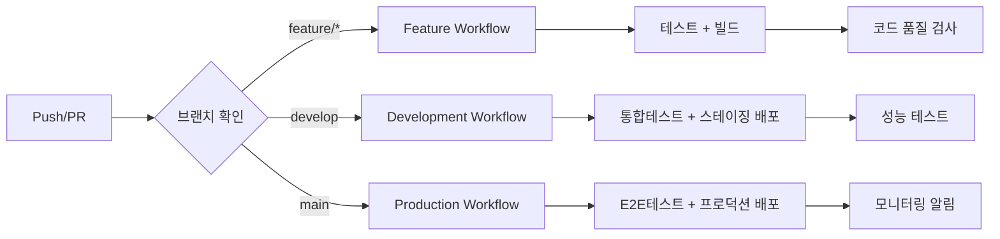

# CI/CD 파이프라인 설계

## 1. Git 브랜치 전략

### 1.1 전략 분석 및 선택

**선택된 전략**: **GitHub Flow (개선된 버전)**

#### 비교 분석

| 측면 | Git Flow | GitHub Flow | 선택 근거 |
|------|----------|-------------|----------|
| 복잡성 | 높음 (5개 브랜치) | 낮음 (2개 브랜치) | ✅ 작은 팀에 적합 |
| 학습 곡선 | 높음 | 낮음 | ✅ 신규 개발자 온보딩 용이 |
| 배포 주기 | 정해진 릴리스 | 지속적 배포 | ✅ 빠른 기능 배포 |
| 핫픽스 처리 | 복잡 (hotfix 브랜치) | 간단 (직접 처리) | ✅ 신속한 버그 수정 |
| 병렬 개발 | 복잡 | 간단 | ✅ 작은 팀 특성 |

#### 선택 근거

**프로젝트 특성에 맞는 결정**:
- 💡 **팀 크기**: 5-6명의 작은 개발팀
- 💡 **프로젝트 성격**: 내부 사용 시스템 (낮은 위험도)
- 💡 **배포 주기**: 지속적 개선 및 빠른 피드백 필요
- 💡 **유지보수**: 간단한 브랜치 관리 필요

### 1.2 GitHub Flow 개선 브랜치 전략

```
main (프로덕션)
├── develop (개발 통합)
├── feature/auth-system
├── feature/ocr-integration
├── hotfix/critical-bug-fix
└── release/v1.0.0 (릴리스 준비)
```

#### 브랜치 구조

**1. main 브랜치**
- **목적**: 프로덕션 배포 가능한 안정적인 코드
- **보호 정책**: 직접 푸시 금지, PR을 통한 병합만 허용
- **자동화**: 병합 시 자동 배포 트리거
- **태깅**: 릴리스 버전 자동 태깅

**2. develop 브랜치**
- **목적**: 개발 중인 기능들의 통합 브랜치
- **테스팅**: 자동 통합 테스트 실행
- **배포**: 스테이징 환경 자동 배포
- **품질 관리**: 코드 리뷰 및 테스트 필수

**3. feature/* 브랜치**
- **네이밍**: `feature/기능명` (예: `feature/user-authentication`)
- **수명**: 짧은 수명 (1-2주 이내)
- **병합**: develop 브랜치로 병합 후 삭제
- **자동화**: PR 생성 시 자동 테스트 실행

**4. hotfix/* 브랜치**
- **네이밍**: `hotfix/버그설명` (예: `hotfix/auth-token-expiry`)
- **긴급성**: 프로덕션 긴급 수정용
- **병합**: main과 develop 양쪽에 병합
- **우선순위**: 최우선 처리 및 즉시 배포

**5. release/* 브랜치 (선택적)**
- **네이밍**: `release/v1.0.0`
- **목적**: 릴리스 준비 및 최종 테스트
- **기간**: 짧은 기간 (3-5일)
- **병합**: main과 develop에 병합

### 1.3 브랜치 보호 정책

#### main 브랜치 보호 설정
```yaml
보호 규칙:
  - 직접 푸시 금지
  - PR 필수 (최소 1명 승인)
  - 상태 체크 필수 통과
    - CI 테스트 통과
    - 코드 커버리지 80% 이상
    - 보안 스캔 통과
  - 최신 상태 확인 필수
  - 관리자도 규칙 적용
```

#### develop 브랜치 보호 설정
```yaml
보호 규칙:
  - PR 필수 (최소 1명 승인)
  - CI 테스트 통과 필수
  - 자동 병합 허용 (조건 충족 시)
```

### 1.4 커밋 메시지 컨벤션

**Conventional Commits 표준 적용**:

```
<타입>[선택적 스코프]: <설명>

[선택적 본문]

[선택적 푸터]
```

#### 타입 정의
```yaml
feat:     새로운 기능 추가
fix:      버그 수정
docs:     문서 변경
style:    코드 포맷팅 (로직 변경 없음)
refactor: 코드 리팩토링
test:     테스트 추가/수정
chore:    빌드 설정, 의존성 업데이트
perf:     성능 개선
ci:       CI/CD 설정 변경
```

#### 예시
```bash
feat(auth): 사용자 로그인 기능 구현

JWT 토큰 기반 인증 시스템을 구현했습니다.
- 로그인/로그아웃 API 엔드포인트 추가
- JWT 미들웨어 구현
- 사용자 세션 관리

Closes #123
```

## 2. GitHub Actions 워크플로우 설계

### 2.1 워크플로우 아키텍처



### 2.2 CI 워크플로우 구성

#### 2.2.1 Pull Request 워크플로우 (ci-pr.yml)

**목적**: PR 생성/업데이트 시 코드 품질 및 안정성 검증

**트리거 조건**:
```yaml
on:
  pull_request:
    branches: [develop, main]
    paths:
      - 'apps/**'
      - 'packages/**'
      - '.github/workflows/**'
```

**작업 단계**:
1. **코드 품질 검사**
   - ESLint (JavaScript/TypeScript)
   - Prettier (코드 포맷팅)
   - Python flake8, black (Python)
   - 의존성 보안 스캔 (npm audit, safety)

2. **단위 테스트**
   - Frontend: Vitest + React Testing Library
   - Backend: Jest + Supertest
   - OCR Service: pytest

3. **타입 체크**
   - TypeScript 컴파일 확인
   - Python mypy 타입 검사

4. **빌드 테스트**
   - 프로덕션 빌드 성공 여부 확인
   - Docker 이미지 빌드 테스트

#### 2.2.2 지속적 통합 워크플로우 (ci-main.yml)

**목적**: develop/main 브랜치 푸시 시 전체 통합 테스트

**트리거 조건**:
```yaml
on:
  push:
    branches: [develop, main]
```

**작업 단계**:
1. **전체 테스트 스위트**
   - 단위 테스트 (전체 모듈)
   - 통합 테스트 (API + DB)
   - E2E 테스트 (Playwright)

2. **성능 테스트**
   - API 응답 시간 측정
   - 메모리 사용량 체크
   - OCR 처리 속도 벤치마크

3. **보안 검사**
   - 코드 취약점 스캔 (CodeQL)
   - 의존성 취약점 체크
   - Docker 이미지 보안 스캔

4. **아티팩트 생성**
   - 테스트 커버리지 리포트
   - 성능 벤치마크 결과
   - 빌드 아티팩트 저장

### 2.3 CD 워크플로우 구성

#### 2.3.1 스테이징 배포 (deploy-staging.yml)

**목적**: develop 브랜치의 안정적인 코드를 스테이징 환경에 자동 배포

**트리거 조건**:
```yaml
on:
  push:
    branches: [develop]
  workflow_dispatch:  # 수동 실행 허용
```

**배포 단계**:
1. **환경 준비**
   - 스테이징 서버 연결 확인
   - 환경 변수 설정
   - 데이터베이스 마이그레이션

2. **서비스별 배포**
   - Frontend: Nginx 정적 파일 배포
   - Backend: PM2 프로세스 재시작
   - OCR Service: Gunicorn 서비스 업데이트
   - Database: 마이그레이션 실행

3. **배포 검증**
   - 헬스체크 API 호출
   - 서비스 간 통신 테스트
   - 기본 기능 스모크 테스트

4. **알림 발송**
   - Slack 채널 배포 완료 알림
   - 테스트 URL 공유

#### 2.3.2 프로덕션 배포 (deploy-production.yml)

**목적**: main 브랜치의 태그된 릴리스를 프로덕션에 안전하게 배포

**트리거 조건**:
```yaml
on:
  push:
    tags:
      - 'v*.*.*'  # v1.0.0 형태의 태그
  workflow_dispatch:  # 수동 실행 (승인 필요)
```

**배포 전략**: **블루-그린 배포**

**배포 단계**:
1. **사전 검증**
   - 프로덕션 환경 상태 확인
   - 데이터베이스 백업 생성
   - 롤백 계획 준비

2. **그린 환경 준비**
   - 새로운 버전 컨테이너 배포
   - 데이터베이스 마이그레이션 (테스트)
   - 설정 파일 업데이트

3. **트래픽 전환**
   - 헬스체크 확인
   - 로드밸런서 트래픽 점진적 전환 (Canary)
   - 실시간 모니터링

4. **배포 완료**
   - 기존 블루 환경 정리
   - 버전 태그 업데이트
   - 배포 완료 알림

### 2.4 모니터링 및 알림

#### 2.4.1 워크플로우 모니터링

**메트릭 수집**:
```yaml
수집 데이터:
  - 빌드 시간 (서비스별)
  - 테스트 실행 시간
  - 테스트 커버리지 변화
  - 배포 성공/실패율
  - 평균 복구 시간 (MTTR)
```

**대시보드**: GitHub Actions 대시보드 + Grafana

#### 2.4.2 알림 시스템

**Slack 통합**:
```yaml
알림 채널:
  - #dev-ci: CI 빌드 상태
  - #dev-deploy: 배포 알림
  - #dev-alerts: 실패 및 긴급 알림

알림 내용:
  - 빌드/배포 상태
  - 테스트 커버리지 변화
  - 보안 취약점 발견
  - 성능 저하 감지
```

## 3. 테스트 자동화 전략

### 3.1 테스트 피라미드 구조

```
        /\
       /  \
      / E2E \ (10%)
     /______\
    /        \
   / 통합테스트 \ (20%)
  /_________\
 /            \
/  단위테스트   \ (70%)
/______________\
```

### 3.2 단위 테스트 전략

#### Frontend (React + TypeScript)
- **프레임워크**: Vitest + React Testing Library
- **커버리지 목표**: 80% 이상
- **테스트 대상**:
  - 컴포넌트 렌더링
  - 사용자 상호작용
  - 커스텀 훅
  - 유틸리티 함수

**예시 테스트 구조**:
```typescript
// LoginForm.test.tsx
describe('LoginForm', () => {
  it('사용자 입력에 따라 상태가 업데이트된다', () => {
    render(<LoginForm />);
    const emailInput = screen.getByLabelText('이메일');
    fireEvent.change(emailInput, { target: { value: 'test@test.com' } });
    expect(emailInput).toHaveValue('test@test.com');
  });
});
```

#### Backend (NestJS + TypeScript)
- **프레임워크**: Jest + Supertest
- **커버리지 목표**: 85% 이상
- **테스트 대상**:
  - 컨트롤러 엔드포인트
  - 서비스 비즈니스 로직
  - 리포지토리 계층
  - 미들웨어 및 가드

**예시 테스트 구조**:
```typescript
// auth.controller.spec.ts
describe('AuthController', () => {
  it('POST /auth/login 유효한 크리덴셜로 JWT 토큰 반환', async () => {
    const loginDto = { email: 'test@test.com', password: 'password' };
    return request(app.getHttpServer())
      .post('/auth/login')
      .send(loginDto)
      .expect(201)
      .expect(res => {
        expect(res.body.access_token).toBeDefined();
      });
  });
});
```

#### OCR Service (Python + FastAPI)
- **프레임워크**: pytest + httpx
- **커버리지 목표**: 80% 이상
- **테스트 대상**:
  - API 엔드포인트
  - OCR 처리 로직
  - 이미지 전처리
  - 결과 검증

**예시 테스트 구조**:
```python
# test_ocr_service.py
def test_process_receipt_image():
    client = TestClient(app)
    with open("test_receipt.jpg", "rb") as f:
        response = client.post(
            "/api/ocr/process",
            files={"file": ("test_receipt.jpg", f, "image/jpeg")}
        )
    assert response.status_code == 200
    assert "amount" in response.json()
```

### 3.3 통합 테스트 전략

#### API 통합 테스트
- **도구**: Supertest (Node.js) + TestContainers
- **테스트 환경**: 실제 데이터베이스 컨테이너
- **테스트 범위**:
  - 전체 API 워크플로우
  - 데이터베이스 트랜잭션
  - 서비스 간 통신
  - 인증/권한 체계

#### 데이터베이스 통합 테스트
- **전략**: 각 테스트마다 깨끗한 데이터베이스 상태
- **도구**: PostgreSQL TestContainer
- **테스트 데이터**: Factory 패턴으로 일관된 테스트 데이터 생성

### 3.4 E2E 테스트 전략

#### Playwright 기반 E2E 테스트
- **브라우저**: Chrome, Firefox, Safari
- **테스트 시나리오**:
  - 사용자 회원가입/로그인 플로우
  - 예산서 작성 완전한 워크플로우
  - 영수증 업로드 및 OCR 처리
  - 결산서 생성 및 인쇄

**핵심 테스트 케이스**:
```typescript
// budget-creation.e2e.ts
test('사용자가 새 행사 예산서를 작성할 수 있다', async ({ page }) => {
  await page.goto('/login');
  await page.fill('[data-testid=email]', 'test@test.com');
  await page.fill('[data-testid=password]', 'password');
  await page.click('[data-testid=login-button]');
  
  await page.click('[data-testid=create-project]');
  await page.fill('[data-testid=project-name]', '여름 수련회');
  await page.fill('[data-testid=budget-amount]', '1000000');
  
  await page.click('[data-testid=save-budget]');
  await expect(page.locator('[data-testid=success-message]')).toBeVisible();
});
```

### 3.5 성능 테스트 전략

#### API 성능 테스트
- **도구**: K6 + Grafana
- **측정 항목**:
  - 응답 시간 (평균 < 200ms)
  - 처리량 (TPS)
  - 에러율 (< 1%)
  - 리소스 사용량

#### OCR 성능 테스트
- **목표**: 이미지당 처리 시간 < 3초
- **동시 처리**: 최대 10개 이미지 동시 처리
- **정확도**: 90% 이상 텍스트 인식 정확도

### 3.6 테스트 데이터 관리

#### 테스트 데이터 전략
```yaml
데이터 분류:
  고정 데이터:
    - 기본 사용자 계정
    - 단체 정보
    - 기본 카테고리
    
  동적 데이터:
    - 행사/프로젝트 데이터
    - 예결산 데이터
    - 업로드 파일
    
  민감 데이터:
    - 개인정보 마스킹
    - 금액 데이터 익명화
```

#### Factory 패턴 구현
```typescript
// test-factories.ts
export class UserFactory {
  static create(overrides?: Partial<User>): User {
    return {
      id: faker.datatype.uuid(),
      email: faker.internet.email(),
      name: faker.name.fullName(),
      organization: 'test-org',
      ...overrides
    };
  }
}
```

## 4. 배포 단계 정의

### 4.1 환경별 배포 전략

#### 개발 환경 (Development)
- **목적**: 개발자 로컬 테스트
- **배포 방식**: 수동 (Docker Compose)
- **데이터**: 목 데이터 사용
- **모니터링**: 기본 로깅

#### 스테이징 환경 (Staging)
- **목적**: 통합 테스트 및 사용자 수용 테스트
- **배포 방식**: 자동 (develop 브랜치 푸시 시)
- **데이터**: 프로덕션 유사 테스트 데이터
- **모니터링**: 프로덕션과 동일한 모니터링

#### 프로덕션 환경 (Production)
- **목적**: 실제 사용자 서비스
- **배포 방식**: 반자동 (태그 기반, 승인 필요)
- **데이터**: 실제 운영 데이터
- **모니터링**: 완전한 모니터링 및 알림

### 4.2 배포 파이프라인 단계

#### 1단계: 코드 품질 검증
```yaml
작업 목록:
  - 코드 스타일 검사 (ESLint, Prettier)
  - 정적 분석 (SonarQube)
  - 보안 취약점 스캔 (CodeQL)
  - 의존성 검사 (npm audit)
```

#### 2단계: 자동화된 테스트
```yaml
병렬 실행:
  - 단위 테스트 (Jest, Vitest, pytest)
  - 통합 테스트 (TestContainers)
  - API 테스트 (Supertest)
  - E2E 테스트 (Playwright)
```

#### 3단계: 빌드 및 아티팩트 생성
```yaml
빌드 작업:
  - Frontend: VITE 프로덕션 빌드
  - Backend: NestJS 컴파일 및 최적화
  - OCR Service: Python 패키지 빌드
  - Docker: 멀티스테이지 이미지 빌드
```

#### 4단계: 배포 준비
```yaml
배포 전 작업:
  - 컨테이너 이미지 레지스트리 푸시
  - 데이터베이스 마이그레이션 스크립트 준비
  - 설정 파일 업데이트
  - 롤백 계획 준비
```

#### 5단계: 배포 실행
```yaml
배포 순서:
  1. 데이터베이스 마이그레이션
  2. OCR Service 배포
  3. Backend API 배포
  4. Frontend 배포
  5. 리버스 프록시 설정 업데이트
```

#### 6단계: 배포 검증
```yaml
검증 작업:
  - 서비스 헬스체크
  - 스모크 테스트 실행
  - 성능 모니터링 확인
  - 로그 에러 체크
```

### 4.3 롤백 전략

#### 자동 롤백 조건
```yaml
트리거 조건:
  - 헬스체크 실패 (3회 연속)
  - 에러율 5% 초과
  - 응답시간 3초 초과
  - 메모리 사용량 90% 초과
```

#### 롤백 프로세스
```yaml
롤백 단계:
  1. 트래픽 이전 버전으로 라우팅
  2. 현재 버전 컨테이너 중지
  3. 데이터베이스 롤백 (필요시)
  4. 모니터링 및 알림
  5. 사후 분석 보고서 작성
```

## 5. 보안 및 컴플라이언스

### 5.1 시크릿 관리

#### GitHub Secrets 관리
```yaml
환경별 시크릿:
  Development:
    - DEV_DATABASE_URL
    - DEV_JWT_SECRET
    
  Staging:
    - STAGING_DATABASE_URL
    - STAGING_JWT_SECRET
    - STAGING_DEPLOY_KEY
    
  Production:
    - PROD_DATABASE_URL
    - PROD_JWT_SECRET
    - PROD_DEPLOY_KEY
    - PROD_BACKUP_ACCESS_KEY
```

### 5.2 보안 검사 자동화

#### SAST (정적 애플리케이션 보안 테스트)
- **도구**: CodeQL, SonarQube
- **검사 항목**: SQL 인젝션, XSS, CSRF 취약점
- **실행 시점**: 모든 PR 및 메인 브랜치 푸시

#### 의존성 보안 검사
- **도구**: npm audit, safety (Python)
- **정책**: HIGH 이상 취약점 발견 시 빌드 실패
- **자동 업데이트**: Dependabot으로 보안 패치 자동 PR

#### 컨테이너 보안 검사
- **도구**: Trivy, Docker Bench
- **검사 항목**: 베이스 이미지 취약점, 컨테이너 설정
- **실행 시점**: Docker 이미지 빌드 후

## 6. 모니터링 및 알림

### 6.1 빌드 모니터링

#### 메트릭 수집
```yaml
수집 데이터:
  빌드 메트릭:
    - 빌드 성공/실패율
    - 평균 빌드 시간
    - 테스트 커버리지 추이
    - 코드 품질 점수
    
  배포 메트릭:
    - 배포 빈도
    - 평균 배포 시간
    - 배포 성공율
    - 롤백 발생 빈도
```

#### 성능 추적
- **빌드 시간 최적화**: 캐싱 전략으로 빌드 시간 30% 단축
- **테스트 병렬화**: 멀티코어 활용으로 테스트 시간 50% 단축
- **아티팩트 최적화**: 압축 및 최적화로 배포 시간 40% 단축

### 6.2 알림 시스템

#### Slack 통합
```yaml
채널별 알림:
  #dev-ci:
    - PR 빌드 상태
    - 테스트 결과
    - 커버리지 변화
    
  #dev-deploy:
    - 배포 시작/완료
    - 환경별 배포 상태
    - 롤백 발생 알림
    
  #dev-alerts:
    - 빌드/배포 실패
    - 보안 취약점 발견
    - 성능 임계값 초과
```

## 7. 성능 최적화

### 7.1 빌드 최적화

#### 캐싱 전략
```yaml
캐시 레이어:
  Node.js:
    - node_modules 캐싱
    - npm 캐시 활용
    - TypeScript 증분 빌드
    
  Python:
    - pip 캐시
    - 컴파일된 패키지 캐싱
    
  Docker:
    - 레이어 캐싱
    - 멀티스테이지 빌드 최적화
```

#### 병렬화 전략
```yaml
병렬 작업:
  테스트 실행:
    - 서비스별 테스트 병렬 실행
    - 테스트 파일 단위 병렬화
    
  빌드 과정:
    - Frontend/Backend/OCR 동시 빌드
    - 이미지 빌드 병렬화
```

### 7.2 배포 최적화

#### Blue-Green 배포 개선
- **Zero-Downtime**: 서비스 중단 없는 배포
- **빠른 롤백**: 30초 이내 이전 버전으로 롤백
- **점진적 배포**: Canary 배포로 위험 최소화

#### 리소스 최적화
- **컨테이너 리소스**: 메모리 및 CPU 사용량 최적화
- **네트워크**: CDN 활용으로 정적 파일 배포 최적화
- **데이터베이스**: 인덱스 최적화 및 연결 풀링

---

## 생성 일시
- 작성일: 2025년 9월 7일
- 작성자: DevOps 엔지니어 (아키텍처 설계)
- 문서화: 기술 문서 전문가
- 버전: v1.0
- 검토 예정: 개발팀 리드
- 승인 예정: 프로젝트 매니저